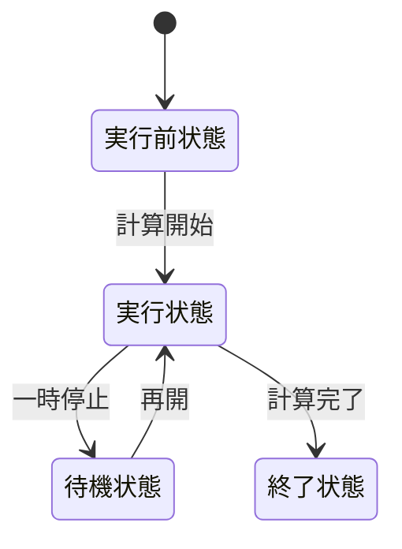
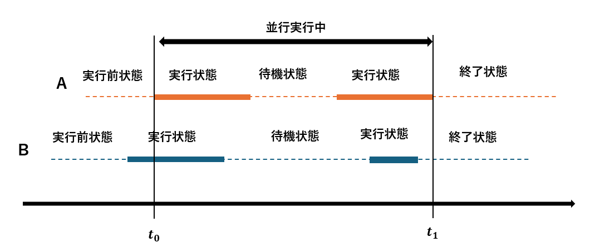
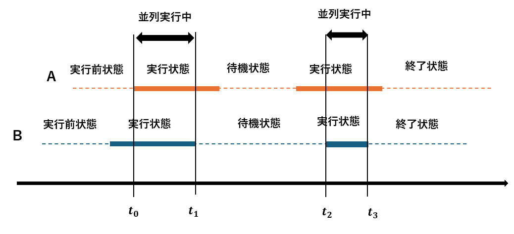
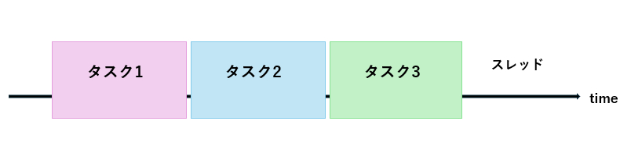
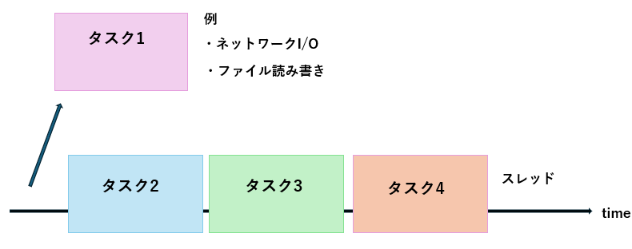
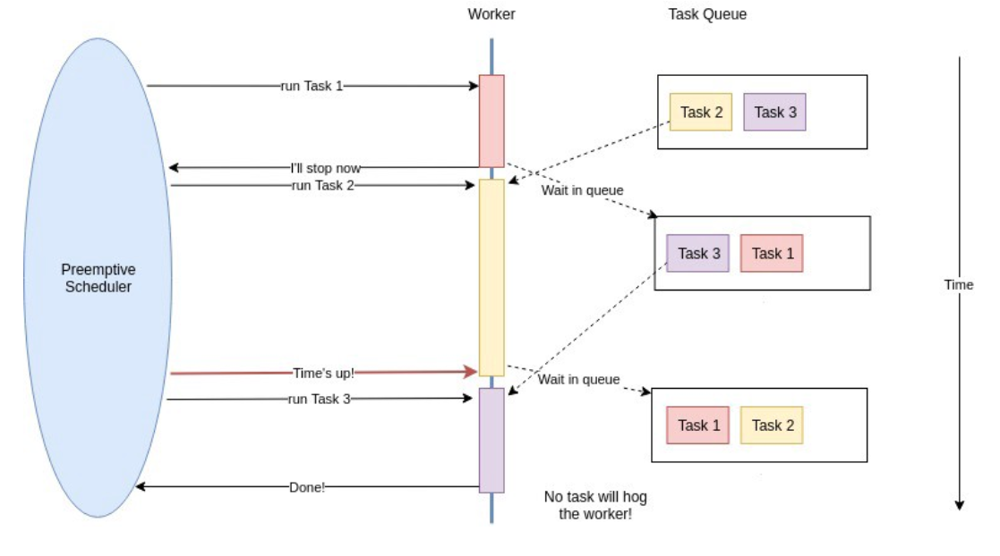
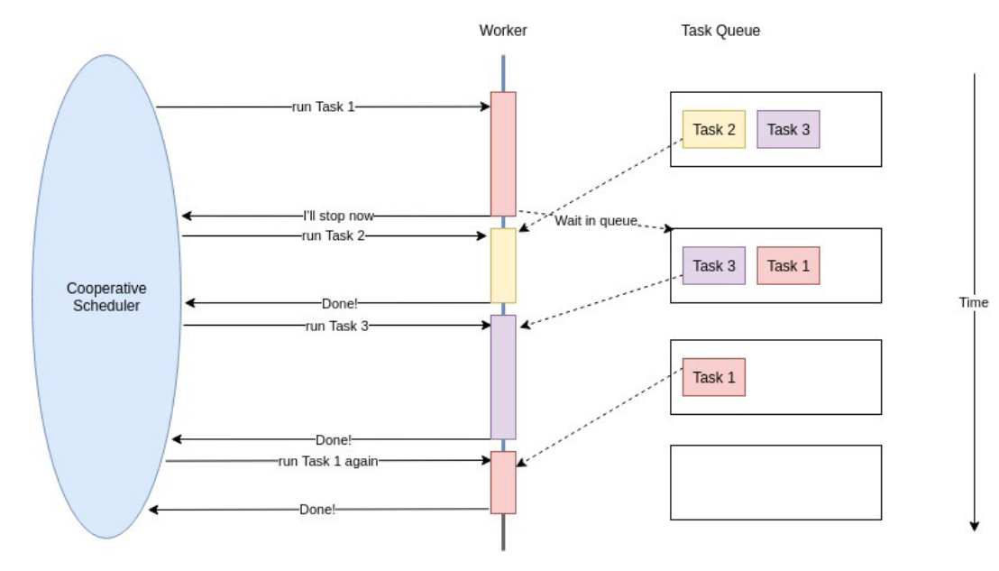

# Rust async/await
Rustの非同期処理の仕組みを知っているとこのような利点があります
* パフォーマンスを最適化できる
* トラブルの原因を追える
* 自作の非同期I/Oが書ける
* 他言語のasync/awaitとの比較ができる  

このような利点があります。
 

- [並行と並列](#並行と並列)  
  - [プロセスとは](#プロセスとは)  
  - [並行とは](#並行とは)  
  - [並列とは](#並列とは)  

- [非同期処理とは](#非同期処理とは)  
  - [同期処理のイメージ](#同期処理のイメージ)  
  - [非同期処理のイメージ](#非同期処理のイメージ)  

- [非同期処理モデル](#非同期処理モデル)  
  - [Preemptive](#preemptive)  
  - [Cooperative](#cooperative)  

- [Rustの非同期処理](Rust_concurrency)  
  - [sleep](#sleep)  
  - [ファイル読み込み](#ファイル読み込み)  
  - [並行サーバー](#並行サーバー)  

 

- [内部の動作](#内部の動作)  
  - [Future](#Future)  
  - [aysnc/await](#aysncawait)  
  - [Task、Executor、Waker](#taskexecutorwaker)  
  - [Spawner](#spawner)  
  - [具体的な動作](#具体的な動作)  

- [I/O多重化](#io多重化)  

- [非同期ライブラリ](#非同期ライブラリ)  

## 並行と並列
並行と並列はしばしば区別されないで使用されているため、ここで2つの違いを明確にしておきたいと思います。一言でいうと、並行とは2つ以上のプロセスが同時に計算を進めている状態で、並列とは2つ以上のプロセスが同時に計算を実行している状態です。RustではTokio Runtimeなどのランタイムを使えば、2つ以上の処理を並列に実行できます。
### プロセスとは
プロセス (process)とはメモリを使って何かをやっている、または待機しているプログラム一つ一つのことです。Windowsだったら、タスクマネージャーを使えば現在稼働しているプロセスの数が確認できるでしょう。また、1つのアプリケーションでも複数のプロセスが動いていることがわかるでしょう。  
プロセスは  
1. 実行前状態：計算を実行する前の状態。実行状態へ遷移可能。
2. 実行状態：計算を実行中の状態。待機状態か計算終了状態へ遷移可能。
3. 待機状態：計算を一時停止中の状態。実行状態へ遷移可能。
4. 終了状態：計算が終了した状態。  

プロセスは常に実行状態になっているわけではなく、実行状態から終了状態へ至る途中で待機状態になることがあります。待機状態になる理由は主に3つです。
* データの到着を待つ  
計算対象となるデータの到着を待つ間、プロセスは待機状態になります。
* 計算リソースの空きを待つ  
プロセスがCPUコアを使って計算をしたいが、CPUコアが空いていないとき、そのプロセスは待機状態になります。
* 自発的に待機状態になる  
タイマーだったり、何もする必要がなくなったときに待機状態になります

### 並行とは
並行とは、2つ以上のプロセスが同時に計算を進めている状態を表す言葉です。
>定義:    
>時刻 *t* において、ある複数のプロセス $p_{0}$、$p_{0}$、$p_{1}$...$p_{n}$ が平行に実行されているということは、ある複数のプロセス $p_{0}$、$p_{0}$、$p_{1}$...$p_{n}$ が時刻 $t$ において計算途中にある、ということである  
出典: [並行プログラミング入門 (オライリー・ジャパン: 高野祐輝 著)](https://www.oreilly.co.jp/books/9784873119595/)

例えば、2人の料理人がいたとします。片方の料理人は包丁を使って料理をしていて、もう片方の料理人は座って休憩しています。このとき、どちらの料理人も料理途中であるため、並行実行中です。  
並行処理には再現性が低いという問題点があります。例えば、n個のプロセスがあるとして、それらを順番に処理するとします。計算する順番は n! パターンもあります。プロセス数が 10 のとき 10!=3628800 パターンもの計算順序があるということです! このパターンの内、数パターンにだけバグが存在した場合、極めて再現性の低い厄介なバグになってしまいます。
### 並列とは
並列とは、同じ時刻で複数のプロセスが同時に計算を実行している状態です。
>定義:    
>時刻 *t* において、ある複数のプロセス $p_{0}$、$p_{0}$、$p_{1}$...$p_{n}$ が並列に実行されているということは、ある複数のプロセス $p_{0}$、$p_{0}$、$p_{1}$...$p_{n}$ が時刻 $t$ において実行状態である、ということである
出典: [並行プログラミング入門 (オライリー・ジャパン: 高野祐輝 著)](https://www.oreilly.co.jp/books/9784873119595/)

また料理人の例を使うと、片方の料理人が包丁を使って料理をしていて、もう片方の料理人も包丁を使って料理をしているとします。この場合、どちらの料理人も料理をしているため、並列実行中です。

## 非同期処理とは
**同期処理とは、処理を待つことでプログラムが順次実行されていくことです**。  
それに対して、**非同期処理とは、ある処理が終了するのを待たずに、別の処理を実行することです**。  
### 同期処理のイメージ
スレッド (thread) とは英語で糸という意味で、タスクを逐次的に実行する流れを指します。スレッドは滑り台のようなもので、スレッドを滑ってきたタスク (処理の単位) はCPUコアなどによって実行されます。タスクはスレッドの上で動く仕事の単位であり、スレッドはタスクを運ぶ器のような役割です。  
同期処理的にプログラムを書くと、このようなイメージで順次実行されます。

タスクの内容に関わらず、タスクは順次処理されます。
* タスク1が終わったら、タスク2を始める
* タスク2が終わったら、タスク3を始める
...

これはタスクがCPUコア (計算リソース) を使わない場合もそのタスクが終了するのを待ち続けます。

### 非同期処理のイメージ
非同期処理ではあるタスクが終了することを待たずに、別のタスクに取り掛かることが出来ます。
例えば、
* ファイル読み込み
* ネットワークI/O
* キーボード入力  

同期的にプログラムを書く場合、データの到着を待つ間、スレッドは何も処理できず、ブロックして停止してしまいます。つまり、その間CPUリソースを使わず、スレッドは「ぼーっと」待機しているだけです。  
一方、非同期的にプログラムを書くと、待ちが発生する処理をいったん退避 (中断) し、他のタスクの実行に切り替えられます。退避したタスクは、たとえば入力データやファイルのデータが届いたタイミングで再開され、続きを処理します。これにより、CPUコアを有効活用でき、複数の処理を効率よく並行して進めることができます。

## 非同期処理モデル
スケジューリングとは、ワーカーにタスクを割り当てる仕組みのことです。ワーカーとは、スレッドから送られてくるタスクを実際に実行する「作業者」のような存在です。タスクを実際に処理をするスケジューリングにはCooperative (協調型) とPreemptive (先取型) の2つのスタイルがあります。
### Preemptive
Preemptive型（先取型）スケジューリングでは、スケジューラはタスクをワーカーに割り当てるだけでなく、タスクに 一定の実行時間（タイムスライス） を割り当てます。  
タスクが割り当てられた時間を使い切ると、スケジューラはタスクの実行を強制的に中断し、他のタスクを実行させます。元のタスクは再び順番を待つことになります。  
この方式のメリットは、タスクが長く動きすぎて他のタスクが止まってしまうことを防げることです。  
例えば、物を買うときに並ぶレジを思い出してください。レジには一人の店員さん (CPU、ワーカー) がいて、お客さん (タスク) が順番に並んで会計します。Preemptiveな場合、お客さんが大量の商品を購入して長時間レジを占領していた場合、店員さんから「もう後退してください」と強制され、レジの1番後ろに再度並ばされます。

### Cooperative
Cooperative（協調型）スケジューリングでは、スケジューラはタスクをワーカーに割り当てますが、タスクを いつ中断するかはタスク自身に任せます。  
もし空いているワーカーがなければ、スケジューラは他のタスクを動かせず待つしかありません。  
タスクが「ここで一旦処理を他に譲ろう」と自主的に中断（yield）することで、次のタスクが実行できるようになります。  
この方式のメリットは、コンテキストスイッチが少なく、高速で効率が良いことですが、タスクがいつまでも yield しないと他の処理が止まってしまうリスクがあります。  
先ほどのレジの例で考えましょう。Cooperativeの場合、お客さんが大量の商品を購入して長時間レジを占領していたとしたら、お客さんの列は進みません。商品を大量に購入した人自身がレジを譲らない限り、他のお客さんは何もできないのです。

 

### おわり
Rustと非同期処理を勉強して間もないです。なにか勘違いや、説明不足があったら教えてください。