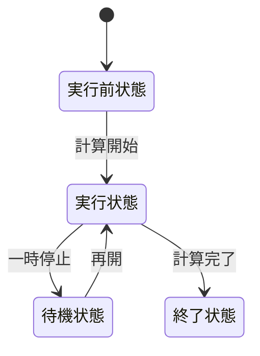
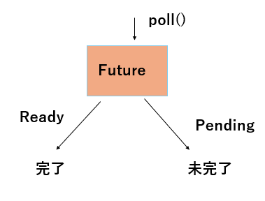
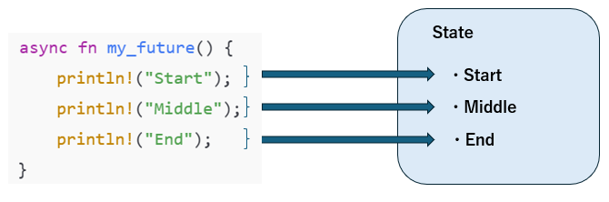
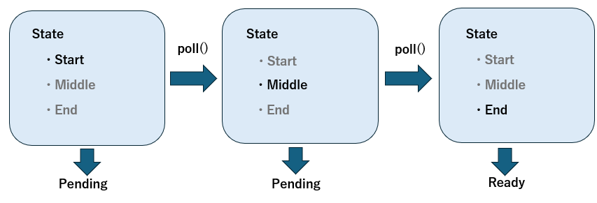
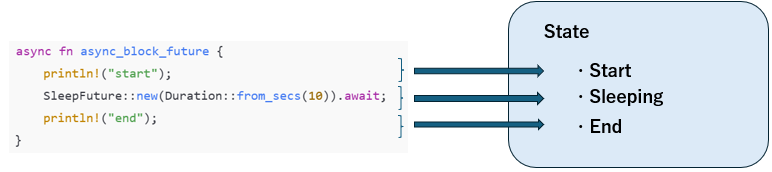

# Rustの非同期処理
Rustの非同期処理の仕組みを知っているとこのような利点があります
* パフォーマンスを最適化できる
* トラブルの原因を追える
* 自作の非同期I/Oが書ける
* 他言語のasync/awaitとの比較ができる  

このような利点があります。

[並行と並列](#並行と並列)  
- [プロセスとは](#プロセスとは)
- [並行とは](#並行とは)  
- [並列とは](#並列とは)  

[非同期処理とは](#非同期処理とは)  
[非同期処理モデル](#非同期処理モデル)  
- [Preemptive](#Preemptive)
- [Cooperative](#Cooperative)  

[Rustの非同期処理](#rustの非同期処理)  
[内部の動作](#内部の動作)  
[Tokioについて](#Tokioについて)  

## 並行と並列
並行と並列はしばしば区別されないで使用されているため、ここで2つの違いを明確にしておきたいと思います。一言でいうと、並行とは2つ以上のプロセスが同時に計算を進めている状態で、並列とは2つ以上のプロセスが同時に計算を実行している状態です。RustではTokio Runtimeなどのランタイムを使えば、2つ以上の処理を並列に実行できます。
### プロセスとは
プロセス (process)とはメモリを使って何かをやっている、または待機しているプログラム一つ一つのことです。Windowsだったら、タスクマネージャーを使えば現在稼働しているプロセスの数が確認できるでしょう。また、1つのアプリケーションでも複数のプロセスが動いていることがわかるでしょう。  
プロセスは  
1. 実行前状態：計算を実行する前の状態。実行状態へ遷移可能。
2. 実行状態：計算を実行中の状態。待機状態か計算終了状態へ遷移可能。
3. 待機状態：計算を一時停止中の状態。実行状態へ遷移可能。
4. 終了状態：計算が終了した状態。  



プロセスは常に実行状態になっているわけではなく、実行状態から終了状態へ至る途中で待機状態になることがあります。待機状態になる理由は主に3つです。
* データの到着を待つ  
計算対象となるデータの到着を待つ間、プロセスは待機状態になります。
* 計算リソースの空きを待つ  
プロセスがCPUコアを使って計算をしたいが、CPUコアが空いていないとき、そのプロセスは待機状態になります。
* 自発的に待機状態になる  
タイマーだったり、何もする必要がなくなったときに待機状態になります

### 並行とは
並行とは、2つ以上のプロセスが同時に計算を進めている状態を表す言葉です。
>定義:    
>時刻 *t* において、ある複数のプロセス $p_{0}$、$p_{0}$、$p_{1}$...$p_{n}$ が平行に実行されているということは、ある複数のプロセス $p_{0}$、$p_{0}$、$p_{1}$...$p_{n}$ が時刻 $t$ において計算途中にある、ということである  
出典: [並行プログラミング入門 (オライリー・ジャパン: 高野祐輝 著)](https://www.oreilly.co.jp/books/9784873119595/)


例えば、2人の料理人がいたとします。片方の料理人は包丁を使って料理をしていて、もう片方の料理人は座って休憩しています。このとき、どちらの料理人も料理途中であるため、並行実行中です。  
並行処理には再現性が低いという問題点があります。例えば、n個のプロセスがあるとして、それらを順番に処理するとします。計算する順番は n! パターンもあります。プロセス数が 10 のとき 10!=3628800 パターンもの計算順序があるということです! このパターンの内、数パターンにだけバグが存在した場合、極めて再現性の低い厄介なバグになってしまいます。
### 並列とは
並列とは、同じ時刻で複数のプロセスが同時に計算を実行している状態です。
>定義:    
>時刻 *t* において、ある複数のプロセス $p_{0}$、$p_{0}$、$p_{1}$...$p_{n}$ が並列に実行されているということは、ある複数のプロセス $p_{0}$、$p_{0}$、$p_{1}$...$p_{n}$ が時刻 $t$ において実行状態である、ということである
出典: [並行プログラミング入門 (オライリー・ジャパン: 高野祐輝 著)](https://www.oreilly.co.jp/books/9784873119595/)

また料理人の例を使うと、片方の料理人が包丁を使って料理をしていて、もう片方の料理人も包丁を使って料理をしているとします。この場合、どちらの料理人も料理をしているため、並列実行中です。


## 非同期処理とは
**同期処理とは、処理を待つことでプログラムが順次実行されていくことです**。  
それに対して、**非同期処理とは、ある処理が終了するのを待たずに、別の処理を実行することです**。  
### 同期処理のイメージ
スレッド (thread) とは英語で糸という意味で、タスクを逐次的に実行する流れを指します。スレッドは滑り台のようなもので、スレッドを滑ってきたタスク (処理の単位) はCPUコアなどによって実行されます。タスクはスレッドの上で動く仕事の単位であり、スレッドはタスクを運ぶ器のような役割です。  
同期処理的にプログラムを書くと、このようなイメージで順次実行されます。

タスクの内容に関わらず、タスクは順次処理されます。
* タスク1が終わったら、タスク2を始める
* タスク2が終わったら、タスク3を始める
...

これはタスクがCPUコア (計算リソース) を使わない場合もそのタスクが終了するのを待ち続けます。

### 非同期処理のイメージ
非同期処理ではあるタスクが終了することを待たずに、別のタスクに取り掛かることが出来ます。
例えば、
* ファイル読み込み
* ネットワークI/O
* キーボード入力  

同期的にプログラムを書く場合、データの到着を待つ間、スレッドは何も処理できず、ブロックして停止してしまいます。つまり、その間CPUリソースを使わず、スレッドは「ぼーっと」待機しているだけです。  
一方、非同期的にプログラムを書くと、待ちが発生する処理をいったん退避 (中断) し、他のタスクの実行に切り替えられます。退避したタスクは、たとえば入力データやファイルのデータが届いたタイミングで再開され、続きを処理します。これにより、CPUコアを有効活用でき、複数の処理を効率よく並行して進めることができます。


## 非同期処理モデル
スケジューリングとは、ワーカーにタスクを割り当てる仕組みのことです。ワーカーとは、スレッドから送られてくるタスクを実際に実行する「作業者」のような存在です。タスクを実際に処理をするスケジューリングにはCooperative (協調型) とPreemptive (先取型) の2つのスタイルがあります。
### Preemptive
Preemptive型（先取型）スケジューリングでは、スケジューラはタスクをワーカーに割り当てるだけでなく、タスクに 一定の実行時間（タイムスライス） を割り当てます。  
タスクが割り当てられた時間を使い切ると、スケジューラはタスクの実行を強制的に中断し、他のタスクを実行させます。元のタスクは再び順番を待つことになります。  
この方式のメリットは、タスクが長く動きすぎて他のタスクが止まってしまうことを防げることです。  
例えば、物を買うときに並ぶレジを思い出してください。レジには一人の店員さん (CPU、ワーカー) がいて、お客さん (タスク) が順番に並んで会計します。Preemptiveな場合、お客さんが大量の商品を購入して長時間レジを占領していた場合、店員さんから「もう後退してください」と強制され、レジの1番後ろに再度並ばされます。

### Cooperative
Cooperative（協調型）スケジューリングでは、スケジューラはタスクをワーカーに割り当てますが、タスクを いつ中断するかはタスク自身に任せます。  
もし空いているワーカーがなければ、スケジューラは他のタスクを動かせず待つしかありません。  
タスクが「ここで一旦処理を他に譲ろう」と自主的に中断（yield）することで、次のタスクが実行できるようになります。  
この方式のメリットは、コンテキストスイッチが少なく、高速で効率が良いことですが、タスクがいつまでも yield しないと他の処理が止まってしまうリスクがあります。  
先ほどのレジの例で考えましょう。Cooperativeの場合、お客さんが大量の商品を購入して長時間レジを占領していたとしたら、お客さんの列は進みません。商品を大量に購入した人自身がレジを譲らない限り、他のお客さんは何もできないのです。


## Rustの非同期処理
Rustの非同期処理はCooperative (協調型) に近い仕組みです。Rustの非同期処理は非同期ランタイム (Tokio、async-stdなど) を用いて書かれることが多いです。これらの非同期ランタイムではスケジューラはユーザランドに存在し、タスクを管理・実行します。  
その振る舞いは、グリーンスレッドに似ています。すなわち：
* OSスレッドとは別にタスクという軽量な単位を扱う
* 複数のタスクを1つまたは少数のスレッドで切り替えて実行する
* スケジューラがユーザランドで動作する  

一旦、構文はおいておき、ここでは非同期ランタイムTokioを用いていくつかの基本的な非同期処理の動作を見ていきましょう。
### sleep
`tokio_runtime/sleep/src/main.rs`
```rust
use std::time;
use tokio::time as tokio_time;

#[tokio::main]
async fn main() {
    // 5秒スリープするタスク
    let five_secs_sleeper = tokio::spawn(async {
        println!("start 5secs sleep");
        let five_secs = time::Duration::from_secs(5);
        tokio_time::sleep(five_secs).await;
        println!("wake from 5secs sleep!");
    });

    // 2秒スリープするタスク
    let two_secs_sleeper = tokio::spawn(async {
        println!("start 2secs sleep");
        let two_secs = time::Duration::from_secs(2);
        tokio_time::sleep(two_secs).await;
        println!("wake from 2secs sleep!");
    });

    // Hello を表示するタスク
    let print_hello = tokio::spawn(async {
        println!("Hello");
    });

    let _ = tokio::join!(five_secs_sleeper, two_secs_sleeper, print_hello);
}


```
出力
```
start 5secs sleep
start 2secs sleep
Hello
wake from 2secs sleep!
wake from 5secs sleep!
```
`tokio::spawn(saync{...})`で新しいタスクが生成、起動されます。タスクの中の`.await`の部分でタスクは一時的に中断 (退避) されます。カーネルのタイマーを使い、指定した時間後に割り込みやイベントでタスクに通知が届きます。「タスクを再開しろ」と通知されたら、処理を再開します。  
スリープ中にCPUは他のタスクを処理できます。
### ファイル読み込み
`tokio_runtime/file_reader/src/main.rs`
```rust
use tokio::fs::File;
use tokio::io::{self, AsyncReadExt};

#[tokio::main]
async fn main() -> io::Result<()> {
    // ファイル読み込みタスク
    let file_task = tokio::spawn(async {
        println!("start reading file");
        let mut file = File::open("example.txt").await?;
        let mut contents = String::new();
        file.read_to_string(&mut contents).await?;
        println!("ファイル内容: {}", contents);
        io::Result::Ok(())
    });

    // Helloと出力するタスク
    let hello_task = tokio::spawn(async {
        println!("Hello");
        io::Result::Ok(())
    });

    let (res1, res2) = tokio::join!(file_task, hello_task);
    res1.unwrap()?;
    res2.unwrap()?;

    Ok(())
}

```
`tokio_runtime/file_reader/example.txt`
```
こんちはー
```
出力
```
start reading file
Hello
ファイル内容: こんちはー
```
ファイルを開く、ファイルを書き込みの部分で`.await`して他のタスクに処理を譲っています。その間`file_task`は一時的に中断 (退避) されます。ファイルを開いたり、ファイルを読み込んだらカーネルから通知が送られて、タスクは再開されます。

### 並行サーバー
このコードではクライアントから送られた入力を、サーバーがそのまま返します。
```rust
use tokio::io::{AsyncBufReadExt, AsyncWriteExt}; 
use tokio::io;
use tokio::net::TcpListener; 

#[tokio::main] 
async fn main() -> io::Result<()> {
    // 10000番ポートでTCPリッスン 
    let listener = TcpListener::bind("127.0.0.1:10000").await.unwrap();

    loop {
        // TCPコネクションアクセプト 
        let (mut socket, addr) = listener.accept().await?;
        println!("accept: {}", addr);

        // 非同期タスク生成 
        tokio::spawn(async move {
            // バッファ読み書き用オブジェクト生成 
            let (r, w) = socket.split(); 
            let mut reader = io::BufReader::new(r);
            let mut writer = io::BufWriter::new(w);

            let mut line = String::new();
            loop {
                line.clear(); 
                // クライアントからの入力を非同期で処理
                match reader.read_line(&mut line).await { 
                    Ok(0) => { 
                        println!("closed: {}", addr);
                        return;
                    }
                    Ok(_) => {
                        print!("read: {}, {}", addr, line);
                        writer.write_all(line.as_bytes()).await.unwrap();
                        writer.flush().await.unwrap();
                    }
                    Err(e) => { // エラー
                        println!("error: {}, {}", addr, e);
                        return;
                    }
                }
            }
        });
    }
}
```
サーバ
```
accept: 127.0.0.1:44514
read: 127.0.0.1:44514, hello
```
クライアント
```
hello
hello
```

`listener.accept().await`で新しいTCP接続を非同期で待ちます。新しい接続がくるたびに、`tokio::spawn`で新しいタスクを起動します。つまり、接続がくるたびに非同期タスクが1つ増えるということです。  
それぞれのタスクは独立に動作し、以下の流れを繰り返します。
* クライアントからの入力を非同期で待つ
* 入力を受け取ったという通知がされる
* タスクを再開する
* 出力
* 再度、入力を非同期で待ち、待機状態になる  

## 内部の動作
### Future
Rustの非同期処理には中心的な概念があります。それが**Future**です。Futureとは簡単に言うと「いずれ値を返すかもしれない計算」を表現するオブジェクトです。
* ネットワークからデータを読む
* ディスクからファイルを読み込む
* タイマーで一定時間待つ  

といった即座には完了しない処理を、RustではFutureという型で表します。　　
Futureとは**Futureトレイト**を実装した構造体です。
```rust
pub trait Future {
    type Output;

    fn poll(
        self: Pin<&mut Self>,
        cx: &mut Context<'_>
    ) -> Poll<Self::Output>;
}
```
Futrueのコアとなるメソッドは`poll`です。このメソッドはFutureに「すすめ！」と伝えるメソッドで、`poll`を呼びだすと返り値としてenumの`Poll`を返します。  
`Pin`はアドレスを絶対に変えないことを保障します。Futureのステートマシンはコンパイラによって内部的に自己参照を生じさせる可能性があります。自己参照のような構造がある状態で、アドレスが変わることをRustのコンパイラは許しません。そのため`Pin`でアドレスを動かさないようにするのです。

```rust
enum Poll<T> {
    Ready(T),   // 計算が終わり、結果が出た
    Pending,    // まだ結果が出ていない
}
```

`poll`が`Pending`を返した場合、処理は一旦中断されます。`Ready`を返した場合、計算は終了します。



指定した時間眠るSleepFutureを実装します。ここで使われているSimpleFutureトレイトはFutureトレイトと同じです。このように`poll`が呼ばれると、`Pending`か`Ready`のどちらかの値を返します。
* 眠っている ⇒ `Pending` (待機状態)
* 起きた ⇒ `Ready` (終了状態)
<details>

```rust
impl SleepFuture{
    fn new(duration:Duration)->Self{
        let sleeper=Self{
            is_sleep: Arc::new(Mutex::new(true)),
            sleep_time: duration,
            spawned: false,
            waker: Arc::new(Mutex::new(None)),
        };
        sleeper
    }
}

impl SimpleFuture for SleepFuture{
    type Output=&'static str;
    fn poll(mut self:Pin<&mut Self>,cx:&mut Context)->Poll<Self::Output>{
        let this=self.as_mut().get_mut();
        if *this.is_sleep.lock().unwrap(){
            println!("...zzz");
            if !this.spawned{
                this.spawned=true;
                let is_sleep_clone=this.is_sleep.clone();
                let waker_clone=this.waker.clone();
                let sleep_time=this.sleep_time;

                thread::spawn(move||{
                    thread::sleep(sleep_time);
                    {
                        *is_sleep_clone.lock().unwrap()=false;
                    }
                    // スレッドがsleepを終えたタイミングにwakerがあればw.wake()が呼ばれる
                    if let Some(w)=waker_clone.lock().unwrap().take(){
                        w.wake(); //スレッドではwake()を呼ぶ
                    }
                });
            }
            *this.waker.lock().unwrap()=Some(cx.waker().clone());
            Poll::Pending
        }else{
            Poll::Ready("wake from sleep!")
        }
    }
}
```

</details>

### aysnc/await
Rustのコンパイラはasyncブロックの中身をステートマシンに変換します。すなわち、asyncで囲われた部分は、いくつかの状態に分かれるのです。この囲われた部分はまるまるFutureになります。ということは、`poll`が呼び出されると`Ready`か`Pending`を返すということです。asyncブロックで生成されたFutureはステートマシンに変換され、`poll`されるたびに状態を変換させながら`Pending`か`Ready`を返します。例えば、以下のようにasyncブロックで囲われた`printfn!()`だけのFutureはどのようなステートマシンに変換されるでしょうか。


このように1単位の処理に対して1単位の状態が割り当てられます。最初の状態は`Start`で`poll`が呼ばれたら`Pending`を返します。再度`poll`が呼ばれたら`Middle`に遷移して`Pending`を返します。また`poll`されたら`End`に遷移して`Ready`を返して、Futureを解放します。


```rust
async fn my_future(){
    println!("Start");
    println!("Middle");
    println!("End");
}
```
この僅か5行のコードは下記のコードのような動作をします。
<details>

```rust
use {
    std::{
        //ops::{Coroutine,CoroutineState},
        future::Future,
        pin::Pin,
        sync::{Arc, Mutex},
        task::{Context, Waker},
        thread::{sleep},
        time::Duration,
    },
};


trait SimpleFuture{
    type Output;
    fn poll(self:Pin<&mut Self>)->Poll<Self::Output>; //自己参照を持つ型をmoveから守る
}

#[derive(Debug)]
enum Poll<T>{
    Ready(T),
    Pending,
}

struct MyFuture{
    state: State,
}

#[derive(Debug)]
enum State{
    Start,
    Middle,
    End,
}

impl MyFuture{
    fn new()->Self{
        Self{
            state:State::Start,
        }
    }
}

impl SimpleFuture for MyFuture{
    type Output=&'static str;
    fn poll(mut self:Pin<&mut Self>)->Poll<Self::Output>{
        let this=self.as_mut().get_mut();
        match this.state{
            State::Start=>{
                println!("Start");
                println!("Yielded: Start -> Middle");
                this.state=State::Middle;
                Poll::Pending
            }
            State::Middle=>{
                println!("Middle");
                println!("Yielded: Middle -> End");
                this.state=State::End;
                Poll::Pending
            }
            State::End=>{
                println!("End");
                Poll::Ready("finished")
            }

        }
    }
}

fn main(){
    let mut my_fut=MyFuture::new();
    let mut pinned=Box::pin(my_fut);

    let mut poll_num=1;
    loop{
        println!("loop...");
        let res=pinned.as_mut().poll();
        match res{
            Poll::Ready(val)=>{
                println!("Cotroutine returned: {} poll={:?}",poll_num,res);
                break;
            }
            Poll::Pending=>{
                println!("Coroutine yielded: {} poll={:?}",poll_num,res);
            }
        }
        poll_num+=1;
        sleep(Duration::from_secs(2));
    }
}


```

</details>

先ほどのSleepFutureをaysncブロックに含めてみるとどのようなステートマシンになるでしょうか。
```rust
async fn async_block_future(){
    println!("start");
    SleepFuture::new(Duration::from_secs(10)).await;
    println!("end");
}
```

asyncブロックはFutureを生成します。ということは、Futureの中にFutureが入っているということになります。Futureは`Pending`を返すことで中断する可能性があります。SleepFutureのように中断する可能性のある部分は`.await`をつける必要があります。Futureがネストしている部分に`.await`をつける必要があるのです。上記の僅か6行のコードは下記のようなコードに書き換えることが
出来ます。

<details>

```rust
struct AsyncBlockFuture{
    state: AsyncBlockState,
    sleep_future: Option<Pin<BoxFuture>>,
}

#[derive(Debug)]
enum AsyncBlockState{
    Start,
    Sleeping,
    End,
}

impl AsyncBlockFuture{
    fn new(duration: Duration)->Self{
        Self{
            state: AsyncBlockState::Start,
            sleep_future: Some(boxed(SleepFuture::new(duration))),
        }
    }
}

impl SimpleFuture for AsyncBlockFuture{
    type Output=&'static str;
    fn poll(mut self:Pin<&mut Self>,cx:&mut Context)->Poll<Self::Output>{
        let this=self.as_mut().get_mut();
        match this.state{
            AsyncBlockState::Start=>{
                println!("start");
                this.state=AsyncBlockState::Sleeping;
                cx.waker().wake_by_ref();
                Poll::Pending
            }
            AsyncBlockState::Sleeping=>{
                let fut=this.sleep_future.as_mut().unwrap();
                match fut.as_mut().poll(cx){
                    Poll::Pending=>{
                        Poll::Pending
                    }
                    Poll::Ready(val)=>{
                        println!("{}",val);
                        this.state=AsyncBlockState::End;
                        cx.waker().wake_by_ref();
                        Poll::Pending
                    }
                }
            }
            AsyncBlockState::End=>{
                Poll::Ready("end")
            }
        }
    }
}
```

</details>


### Task、Executor、Waker
実際にはasyncブロックやawaitを書くだけでは動きません。
```rust
async fn async_block_future(){
    println!("start");
    SleepFuture::new(Duration::from_secs(10)).await;
    println!("end");
}

fn main(){
    let foo=async_block_future();
    foo.await();
}
```
これでは動かないのです。実際に動かすにはFuture以外にもオブジェクトが必要なのです。  
Rustの非同期処理の内部には主に3つのロールがあります。Task、Executor、Wakerです。レストランの厨房を想像してください。料理が注文されて、ウェイターが注文をシェフに知らせます。シェフは注文された料理のリストから一つずつ料理を作ります。料理の注文はTask、注文を知らせるウェイターはWaker、注文された料理をつくるシェフはExecutorに当たります。
#### Task
非同期処理の単位で、Futureをラップしたものです。タスクは主に以下の情報を持っています。
* Future：計算の本体
* 状態管理：Futureがどの段階まで進んでいるか
* Waker：自分をExecutorに再登録する  

`poll`が呼ばれることで、Futureの状態が遷移していきます。最終的に`Ready`を返すことで、そのTaskは解放されます。  
下記にTaskのコード例を挙げます。このコードではTaskは自分自身をExecutorに再スケジューリングするために`poll`されるたびにWakerを作ります。また、`poll`されるたびに内部のFutureの`poll`を呼びま。結果が`Pending`ならWakerを叩いてTaskを再スケジューリングし、`Ready`ならTaskを解放します。

<details>

```rust
// Task /////////////////////////////////////////////////////////////////////////////////////////

struct Task{
    name: String,
    futures: Mutex<Vec<Option<Pin<BoxFuture>>>>,
    executor: Arc<ExecutorInner>,
}

impl Task{
    //自分自身をExecutorのqueueにpushする
    fn schedule(self: &Arc<Self>){
        self.executor.queue.lock().unwrap().push_back(self.clone());
    }

    fn poll(self: Arc<Self>){
        let mut futs=self.futures.lock().unwrap();
        if !futs.is_empty(){
            let mut fut_slot=futs.remove(0);
            if let Some(mut fut)=fut_slot.take(){
                let waker=create_waker(self.clone());
                let mut ctx=Context::from_waker(&waker);

                let res=fut.as_mut().poll(&mut ctx);
                match res{
                    Poll::Ready(val)=>{
                        println!("{}",val);
                        if !futs.is_empty(){
                            self.schedule();
                        }else{
                            println!("Task {} copleted!",self.name);
                        }
                    }
                    Poll::Pending=>{
                        futs.insert(0,Some(fut));
                    }
                }
            }
        }
    }
}
```

</details>

#### Executor
Taskを管理・実行するRustの非同期の心臓部分です。Executorは実行待ちのTaskを`poll`します。逆に言えば、実行待ちのTaskがなければ、なにもしません。  
下記にExecutorのコード例を挙げます。このコードではExecutorは実行待ちのTaskを持つキューを持ちます。`run`でキューにTaskが入っていないかを逐一チェックします。このように逐一チェックする方式を**ポーリング式**と呼びます

<details>

```rust
// Executor ///////////////////////////////////////////////////////////////////////////
//ExecutorInnerは実行待ちのタスクを管理する
//複数スレッドからタスクが追加、取り出しされないようにする
struct ExecutorInner{
    queue: Mutex<VecDeque<Arc<Task>>>, //同じタスクを共有
}

//同じキューを共有
struct Executor{
    inner: Arc<ExecutorInner>,
}

impl Executor{
    fn new()->Self{
        Self {
            inner: Arc::new(ExecutorInner {
                queue: Mutex::new(VecDeque::new()),
             })
        }
    }

    fn run(&self){
        loop{
            let task_opt=self.inner.queue.lock().unwrap().pop_front();

            if let Some(task)=task_opt{
                task.poll();
            }else{
                thread::sleep(Duration::from_millis(10));
            }
        }
       
    }
}
```
</details>

#### Waker
Taskが計算可能になったことをExecutorに伝えます。具体的には、ExecutorのキューにTaskをプッシュします。  
下記にWakerのコード例を挙げます。`create_waker`によってWakerが作られます。作られたWakerはTask内のFutureの`Context`に入れられます。

<details>

```rust
// Waker ///////////////////////////////////////////////////////////////////////////////////
fn create_waker(task: Arc<Task>) -> Waker{
    // Wakerのクローンをつくる
    unsafe fn clone(data: *const ()) -> RawWaker {
        let arc = Arc::from_raw(data as *const Task); //from_rawしたarcはdropすると参照カウントが-1になる
        let arc_clone = arc.clone();
        std::mem::forget(arc); //ドロップした後に参照カウンタを-1しない
        RawWaker::new(data, &VTABLE)
    }

    // Taskを再スケジューリングしてWakerを消費する
    unsafe fn wake(data: *const()){
        let task=Arc::from_raw(data as *const Task);
        task.schedule();
    }

    // Wakerは消費されない
    unsafe fn wake_by_ref(data: *const()){
        let task=Arc::from_raw(data as *const Task);
        task.schedule();
        std::mem::forget(task);
    }

    //参照カウントを1減らす
    unsafe fn drop(data: *const()){
        //let _=Arc::from_raw(data as *const Task);
    }

    //clone,wake,wake_by_ref,dropがWakerに紐づく
    static VTABLE: RawWakerVTable=RawWakerVTable::new(clone,wake,wake_by_ref,drop);

    let ptr=Arc::into_raw(task) as *const(); //Arc<Task>を生ポインタ化
    let raw=RawWaker::new(ptr,&VTABLE); //RawWakerを作成
    unsafe {Waker::from_raw(raw)} //Waker::from_rawで安全なWakerに変換
}
```

</details>

#### Spawner
Task、Executor、Wakerが注文、シェフ、ウェイターだとするとSpawnerは料理の注文をするお客さんです。3つと比べると、メイン級の働きはしないかもしれませんが、便利になる役割を担います。SpawnerはFutureをTaskにラップして、そのTaskをExecutorにプッシュします。すなわち、Taskが  
`poll`→再スケジューリング→`poll`→再スケジューリング ・・・  
のように状態を変え続けるきっかけそのものです。

<details>

```rust
// Spawner ///////////////////////////////////////////////////////////////////////////
struct Spawner{
    inner: Arc<ExecutorInner>,
}

impl Spawner{
    fn new(executor: &Executor)->Self{
        Self{
            inner: executor.inner.clone(),
        }
    }
    fn spawn(&self,name:&str, futures:Vec<Option<Pin<BoxFuture>>>){
        let task=Arc::new(Task{
            name: name.to_string(),
            futures: Mutex::new(futures),
            executor: self.inner.clone(),
        });

        self.inner.queue.lock().unwrap().push_back(task);
    }
}
```

</details>

### 具体的な動作
この例ではTaskを2つ作ります。  
1つは`sleep_future_3secs`というFutureを内包するTaskです。このFutureは最初に`...zzz`と出力した後、別スレッドを起動して3秒間スリープします。3秒間スリープしたら`wake_from`と出力し、Wakerによって再度Executorにプッシュます。
* `is_sleep=true`
* `is_sleep=false`

の2つの状態を持ち、3秒間のスリープが完了したら`is_sleep=false`へ状態遷移します。そして、再度`poll`されると`Ready`を返して終了します。  

もう1つは`async_block_future`というFutureを内包するTaskです。このFutureは
* Start
* Sleeping
    - `is_sleep=true`
    - `is_sleep=false`
* End  

の状態を持ちます。Startで`start`と出力してSleeping状態に遷移します。Sleepingは1つ目のTaskと同じ動作をします。`is_sleeping=false`の状態になり、再度`poll`されたらEndに遷移します。再スケジューリングされ、また`poll`されます。End状態なので`Ready`を返し終了します。
<details>

```rust
use {
    std::{
        thread,
        pin::Pin,
        sync::{Arc, Mutex},
        thread::{sleep},
        time::Duration,
        collections::{VecDeque},
        task::{RawWaker,RawWakerVTable,Waker,Context},
    },
};


// Pin: 自己参照を持つ型をmoveから守る
// Context: Wakerを渡すためのラッパー
trait SimpleFuture{
    type Output;
    fn poll(self:Pin<&mut Self>,cx: &mut Context)->Poll<Self::Output>; 
}

#[derive(Debug)]
enum Poll<T>{
    Ready(T),
    Pending,
}


type BoxFuture = Box<dyn SimpleFuture<Output = &'static str> + Send>;
fn boxed<F>(fut: F) -> Pin<Box<dyn SimpleFuture<Output = &'static str> + Send>>
where
    F: SimpleFuture<Output = &'static str> + Send + 'static,
{
    Pin::from(Box::new(fut) as Box<dyn SimpleFuture<Output = &'static str> + Send>)
}
// Task /////////////////////////////////////////////////////////////////////////////////////////
struct Task{
    name: String,
    futures: Mutex<Vec<Option<Pin<BoxFuture>>>>,
    executor: Arc<ExecutorInner>,
}

impl Task{
    //自分自身をExecutorのqueueにpushする
    fn schedule(self: &Arc<Self>){
        self.executor.queue.lock().unwrap().push_back(self.clone());
    }

    fn poll(self: Arc<Self>){
        let mut futs=self.futures.lock().unwrap();
        if !futs.is_empty(){
            let mut fut_slot=futs.remove(0);
            if let Some(mut fut)=fut_slot.take(){
                let waker=create_waker(self.clone());
                let mut ctx=Context::from_waker(&waker);

                let res=fut.as_mut().poll(&mut ctx);
                match res{
                    Poll::Ready(val)=>{
                        println!("{}",val);
                        if !futs.is_empty(){
                            self.schedule();
                        }else{
                            println!("Task {} copleted!",self.name);
                        }
                    }
                    Poll::Pending=>{
                        futs.insert(0,Some(fut));
                    }
                }
            }
        }
    }
}

// Spawner ///////////////////////////////////////////////////////////////////////////
struct Spawner{
    inner: Arc<ExecutorInner>,
}

impl Spawner{
    fn new(executor: &Executor)->Self{
        Self{
            inner: executor.inner.clone(),
        }
    }
    fn spawn(&self,name:&str, futures:Vec<Option<Pin<BoxFuture>>>){
        let task=Arc::new(Task{
            name: name.to_string(),
            futures: Mutex::new(futures),
            executor: self.inner.clone(),
        });

        self.inner.queue.lock().unwrap().push_back(task);
    }
}

// Executor ///////////////////////////////////////////////////////////////////////////
//ExecutorInnerは実行待ちのタスクを管理する
//複数スレッドからタスクが追加、取り出しされないようにする
struct ExecutorInner{
    queue: Mutex<VecDeque<Arc<Task>>>, //同じタスクを共有
}

//同じキューを共有
struct Executor{
    inner: Arc<ExecutorInner>,
}

impl Executor{
    fn new()->Self{
        Self {
            inner: Arc::new(ExecutorInner {
                queue: Mutex::new(VecDeque::new()),
             })
        }
    }

    fn run(&self){
        loop{
            let task_opt=self.inner.queue.lock().unwrap().pop_front();

            if let Some(task)=task_opt{
                task.poll();
            }else{
                thread::sleep(Duration::from_millis(10));
            }
        }
       
    }
}

// Waker ///////////////////////////////////////////////////////////////////////////////////
fn create_waker(task: Arc<Task>) -> Waker{
    // Wakerのクローンをつくる
    unsafe fn clone(data: *const ()) -> RawWaker {
        let arc = Arc::from_raw(data as *const Task); //from_rawしたarcはdropすると参照カウントが-1になる
        let arc_clone = arc.clone();
        std::mem::forget(arc); //ドロップした後に参照カウンタを-1しない
        RawWaker::new(data, &VTABLE)
    }

    // Taskを再スケジューリングしてWakerを消費する
    unsafe fn wake(data: *const()){
        let task=Arc::from_raw(data as *const Task);
        task.schedule();
    }

    // Wakerは消費されない
    unsafe fn wake_by_ref(data: *const()){
        let task=Arc::from_raw(data as *const Task);
        task.schedule();
        std::mem::forget(task);
    }

    //参照カウントを1減らす
    unsafe fn drop(data: *const()){
        //let _=Arc::from_raw(data as *const Task);
    }

    //clone,wake,wake_by_ref,dropがWakerに紐づく
    static VTABLE: RawWakerVTable=RawWakerVTable::new(clone,wake,wake_by_ref,drop);

    let ptr=Arc::into_raw(task) as *const(); //Arc<Task>を生ポインタ化
    let raw=RawWaker::new(ptr,&VTABLE); //RawWakerを作成
    unsafe {Waker::from_raw(raw)} //Waker::from_rawで安全なWakerに変換
}


// Future ////////////////////////////////////////////////////////////////////////////////
struct MyFuture{
    state: MyState,
}


#[derive(Debug)]
enum MyState{
    Start,
    Middle,
    End,
}

impl MyFuture{
    fn new()->Self{
        Self{
            state:MyState::Start,
        }
    }
}

impl SimpleFuture for MyFuture{
    type Output=&'static str;
    fn poll(mut self:Pin<&mut Self>,cx:&mut Context)->Poll<Self::Output>{
        let this=self.as_mut().get_mut();
        match this.state{
            MyState::Start=>{
                println!("Start");
                println!("Yielded: Start -> Middle");
                this.state=MyState::Middle;
                cx.waker().wake_by_ref(); //自分自身をqueueにpushする
                Poll::Pending
            }
            MyState::Middle=>{
                println!("Middle");
                println!("Yielded: Middle -> End");
                this.state=MyState::End;
                cx.waker().wake_by_ref(); // dorpしない
                Poll::Pending
            }
            MyState::End=>{
                println!("End");
                Poll::Ready("finished")
            }

        }
    }
}

struct SleepFuture{
    is_sleep: Arc<Mutex<bool>>,
    sleep_time: Duration,
    spawned: bool,
    waker: Arc<Mutex<Option<Waker>>>,
}

impl SleepFuture{
    fn new(duration:Duration)->Self{
        let sleeper=Self{
            is_sleep: Arc::new(Mutex::new(true)),
            sleep_time: duration,
            spawned: false,
            waker: Arc::new(Mutex::new(None)),
        };
        sleeper
    }
}

impl SimpleFuture for SleepFuture{
    type Output=&'static str;
    fn poll(mut self:Pin<&mut Self>,cx:&mut Context)->Poll<Self::Output>{
        let this=self.as_mut().get_mut();
        if *this.is_sleep.lock().unwrap(){
            println!("...zzz");
            if !this.spawned{
                this.spawned=true;
                let is_sleep_clone=this.is_sleep.clone();
                let waker_clone=this.waker.clone();
                let sleep_time=this.sleep_time;

                thread::spawn(move||{
                    thread::sleep(sleep_time);
                    {
                        *is_sleep_clone.lock().unwrap()=false;
                    }
                    // スレッドがsleepを終えたタイミングにwakerがあればw.wake()が呼ばれる
                    if let Some(w)=waker_clone.lock().unwrap().take(){
                        w.wake(); //スレッドではwake()を呼ぶ
                    }
                });
            }
            *this.waker.lock().unwrap()=Some(cx.waker().clone());
            Poll::Pending
        }else{
            Poll::Ready("wake from sleep!")
        }
    }
}


struct AsyncBlockFuture{
    state: AsyncBlockState,
    sleep_future: Option<Pin<BoxFuture>>,
}

#[derive(Debug)]
enum AsyncBlockState{
    Start,
    Sleeping,
    End,
}

impl AsyncBlockFuture{
    fn new(duration: Duration)->Self{
        Self{
            state: AsyncBlockState::Start,
            sleep_future: Some(boxed(SleepFuture::new(duration))),
        }
    }
}

impl SimpleFuture for AsyncBlockFuture{
    type Output=&'static str;
    fn poll(mut self:Pin<&mut Self>,cx:&mut Context)->Poll<Self::Output>{
        let this=self.as_mut().get_mut();
        match this.state{
            AsyncBlockState::Start=>{
                println!("start");
                this.state=AsyncBlockState::Sleeping;
                cx.waker().wake_by_ref();
                Poll::Pending
            }
            AsyncBlockState::Sleeping=>{
                let fut=this.sleep_future.as_mut().unwrap();
                match fut.as_mut().poll(cx){
                    Poll::Pending=>{
                        Poll::Pending
                    }
                    Poll::Ready(val)=>{
                        println!("{}",val);
                        this.state=AsyncBlockState::End;
                        cx.waker().wake_by_ref();
                        Poll::Pending
                    }
                }
            }
            AsyncBlockState::End=>{
                Poll::Ready("end")
            }
        }
    }
}

// main ///////////////////////////////////////////////////////////////////////////////////////////////////
fn main(){
    let executor=Executor::new();
    let spawner=Spawner::new(&executor);
    let my_future=MyFuture::new();


    let sleep_future_3secs=SleepFuture::new(Duration::from_secs(3));
    let async_block_future=AsyncBlockFuture::new(Duration::from_secs(6));

    let sleep_future_3secs=Some(boxed(sleep_future_3secs));
    let async_block_future=Some(boxed(async_block_future));

    spawner.spawn("3秒sleepするタスク",vec![sleep_future_3secs]);
    spawner.spawn("Start、Sleep、Endの状態を持つタスク",vec![async_block_future]);

    executor.run();
}
```

出力
```
...zzz
start
...zzz
wake from sleep!
Task 3秒sleepするタスク copleted!
wake from sleep!
end
Task Start、Sleep、Endの状態を持つタスク copleted!
```

</details>


### async/await
### 非同期I/Oの仕組み

## Tokioについて