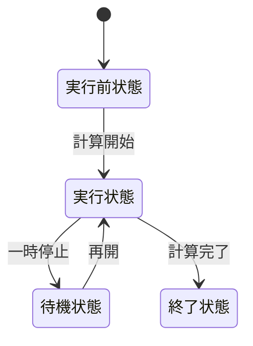

# Rustの非同期処理
Rustの非同期処理の仕組みを知っているとこのような利点があります
* パフォーマンスを最適化できる
* トラブルの原因を追える
* 自作の非同期I/Oが書ける
* 他言語のasync/awaitとの比較ができる  

このような利点があります。

[並行と並列](#並行と並列)  
- [プロセスとは](#プロセスとは)
- [並行とは](#並行とは)  
- [並列とは](#並列とは)  

[非同期処理とは](#非同期処理とは)  
[非同期処理モデル](#非同期処理モデル)  
- [Preemptive](#Preemptive)
- [Cooperative](#Cooperative)  

[Rustの非同期処理](#rustの非同期処理)  
[内部の動作](#内部の動作)  
[Tokioについて](#Tokioについて)  

## 並行と並列
並行と並列はしばしば区別されないで使用されているため、ここで2つの違いを明確にしておきたいと思います。一言でいうと、並行とは2つ以上のプロセスが同時に計算を進めている状態で、並列とは2つ以上のプロセスが同時に計算を実行している状態です。RustではTokio Runtimeなどのランタイムを使えば、2つ以上の処理を並列に実行できます。
### プロセスとは
プロセス (process)とはメモリを使って何かをやっている、または待機しているプログラム一つ一つのことです。Windowsだったら、タスクマネージャーを使えば現在稼働しているプロセスの数が確認できるでしょう。また、1つのアプリケーションでも複数のプロセスが動いていることがわかるでしょう。  
プロセスは  
1. 実行前状態：計算を実行する前の状態。実行状態へ遷移可能。
2. 実行状態：計算を実行中の状態。待機状態か計算終了状態へ遷移可能。
3. 待機状態：計算を一時停止中の状態。実行状態へ遷移可能。
4. 終了状態：計算が終了した状態。  



プロセスは常に実行状態になっているわけではなく、実行状態から終了状態へ至る途中で待機状態になることがあります。待機状態になる理由は主に3つです。
* データの到着を待つ  
計算対象となるデータの到着を待つ間、プロセスは待機状態になります。
* 計算リソースの空きを待つ  
プロセスがCPUコアを使って計算をしたいが、CPUコアが空いていないとき、そのプロセスは待機状態になります。
* 自発的に待機状態になる  
タイマーだったり、何もする必要がなくなったときに待機状態になります

### 並行とは
並行とは、2つ以上のプロセスが同時に計算を進めている状態を表す言葉です。
>定義:    
>時刻 *t* において、ある複数のプロセス $p_{0}$、$p_{0}$、$p_{1}$...$p_{n}$ が平行に実行されているということは、ある複数のプロセス $p_{0}$、$p_{0}$、$p_{1}$...$p_{n}$ が時刻 $t$ において計算途中にある、ということである  
出典: [並行プログラミング入門 (オライリー・ジャパン: 高野祐輝 著)](https://www.oreilly.co.jp/books/9784873119595/)


例えば、2人の料理人がいたとします。片方の料理人は包丁を使って料理をしていて、もう片方の料理人は座って休憩しています。このとき、どちらの料理人も料理途中であるため、並行実行中です。  
並行処理には再現性が低いという問題点があります。例えば、n個のプロセスがあるとして、それらを順番に処理するとします。計算する順番は n! パターンもあります。プロセス数が 10 のとき 10!=3628800 パターンもの計算順序があるということです! このパターンの内、数パターンにだけバグが存在した場合、極めて再現性の低い厄介なバグになってしまいます。
### 並列とは
並列とは、同じ時刻で複数のプロセスが同時に計算を実行している状態です。
>定義:    
>時刻 *t* において、ある複数のプロセス $p_{0}$、$p_{0}$、$p_{1}$...$p_{n}$ が並列に実行されているということは、ある複数のプロセス $p_{0}$、$p_{0}$、$p_{1}$...$p_{n}$ が時刻 $t$ において実行状態である、ということである
出典: [並行プログラミング入門 (オライリー・ジャパン: 高野祐輝 著)](https://www.oreilly.co.jp/books/9784873119595/)

また料理人の例を使うと、片方の料理人が包丁を使って料理をしていて、もう片方の料理人も包丁を使って料理をしているとします。この場合、どちらの料理人も料理をしているため、並列実行中です。


## 非同期処理とは
**同期処理とは、処理を待つことでプログラムが順次実行されていくことです**。  
それに対して、**非同期処理とは、ある処理が終了するのを待たずに、別の処理を実行することです**。  
### 同期処理のイメージ
スレッド (thread) とは英語で糸という意味で、タスクを逐次的に実行する流れを指します。スレッドは滑り台のようなもので、スレッドを滑ってきたタスク (処理の単位) はCPUコアなどによって実行されます。タスクはスレッドの上で動く仕事の単位であり、スレッドはタスクを運ぶ器のような役割です。  
同期処理的にプログラムを書くと、このようなイメージで順次実行されます。

タスクの内容に関わらず、タスクは順次処理されます。
* タスク1が終わったら、タスク2を始める
* タスク2が終わったら、タスク3を始める
...

これはタスクがCPUコア (計算リソース) を使わない場合もそのタスクが終了するのを待ち続けます。

### 非同期処理のイメージ
非同期処理ではあるタスクが終了することを待たずに、別のタスクに取り掛かることが出来ます。
例えば、
* ファイル読み込み
* ネットワークI/O
* キーボード入力  

これらの処理は、データの到着を待っている間はCPUコアをほとんど使いません。もし同期的に処理する場合、これらの処理を待っている間、スレッドは何もせずにブロックして、ただぼーっとしているだけです。非同期的にプログラムを書いて、このようなタスクを退避さて、他のタスクを実行することができます。退避されたタスクは、入力データやファイル内データが到着したタイミングで再開され、処理の続きを行います。


## 非同期処理モデル
スケジューリングとは、ワーカーにタスクを割り当てる仕組みのことです。ワーカーとは、スレッドから送られてくるタスクを実際に実行する「作業者」のような存在です。タスクを実際に処理をするスケジューリングにはCooperative (協調型) とPreemptive (先取型) の2つのスタイルがあります。
### Preemptive
Preemptive型（先取型）スケジューリングでは、スケジューラはタスクをワーカーに割り当てるだけでなく、タスクに 一定の実行時間（タイムスライス） を割り当てます。  
タスクが割り当てられた時間を使い切ると、スケジューラはタスクの実行を強制的に中断し、他のタスクを実行させます。元のタスクは再び順番を待つことになります。  
この方式のメリットは、タスクが長く動きすぎて他のタスクが止まってしまうことを防げることです。

### Cooperative
Cooperative（協調型）スケジューリングでは、スケジューラはタスクをワーカーに割り当てますが、タスクを いつ中断するかをタスク自身に任せます。  
もし空いているワーカーがなければ、スケジューラは他のタスクを動かせず待つしかありません。  
タスクが「ここで一旦処理を他に譲ろう」と自主的に中断（yield）することで、次のタスクが実行できるようになります。  
この方式のメリットは、コンテキストスイッチが少なく、高速で効率が良いことですが、タスクがいつまでも yield しないと他の処理が止まってしまうリスクがあります。


## Rustの非同期処理
Rustの非同期処理はCooperative (協調型) に近い仕組みです。Rustの非同期処理は非同期ランタイム (Tokio、async-stdなど) を用いて書かれることが多いです。これらの非同期ランタイムではスケジューラはユーザランドに存在し、タスクを管理・実行します。  
その振る舞いは、グリーンスレッドに似ています。すなわち：
* OSスレッドとは別にタスクという軽量な単位を扱う
* 複数のタスクを少ないスレッドで切り替えて実行する
* スケジューラがユーザランドで動作する  

一旦、構文はおいておき、ここでは非同期ランタイムTokioを用いていくつかの基本的な非同期処理の動作を見ていきましょう。
### sleep
`tokio_runtime/sleep/src/main.rs`
```rust
use std::time;
use tokio::time as tokio_time;

#[tokio::main]
async fn main() {
    // 5秒スリープするタスク
    let five_secs_sleeper = tokio::spawn(async {
        println!("start 5secs sleep");
        let five_secs = time::Duration::from_secs(5);
        tokio_time::sleep(five_secs).await;
        println!("wake from 5secs sleep!");
    });

    // 2秒スリープするタスク
    let two_secs_sleeper = tokio::spawn(async {
        println!("start 2secs sleep");
        let two_secs = time::Duration::from_secs(2);
        tokio_time::sleep(two_secs).await;
        println!("wake from 2secs sleep!");
    });

    // Hello を表示するタスク
    let print_hello = tokio::spawn(async {
        println!("Hello");
    });

    let _ = tokio::join!(five_secs_sleeper, two_secs_sleeper, hello_sleeper);
}


```
出力
```
start 5secs sleep
start 2secs sleep
Hello
wake from 2secs sleep!
wake from 5secs sleep!
```
`tokio::spawn(saync{`で新しいタスクが生成、起動されます。タスクの中の`.await`の部分でタスクは一時的に中断 (退避) されます。カーネルのタイマーを使い、指定した時間後に割り込みやイベントでタスクに通知が届きます。「タスクを再開しろ」と通知されたら、処理を再開します。  
スリープ中にCPUは他のタスクを処理できます。
### ファイル読み込み
`tokio_runtime/file_reader/src/main.rs`
```rust
use tokio::fs::File;
use tokio::io::{self, AsyncReadExt};

#[tokio::main]
async fn main() -> io::Result<()> {
    // ファイル読み込みタスク
    let file_task = tokio::spawn(async {
        println!("start reading file");
        let mut file = File::open("example.txt").await?;
        let mut contents = String::new();
        file.read_to_string(&mut contents).await?;
        println!("ファイル内容: {}", contents);
        io::Result::Ok(())
    });

    // Helloと出力するタスク
    let hello_task = tokio::spawn(async {
        println!("Hello");
        io::Result::Ok(())
    });

    let (res1, res2) = tokio::join!(file_task, hello_task);
    res1.unwrap()?;
    res2.unwrap()?;

    Ok(())
}

```
`tokio_runtime/file_reader/example.txt`
```
こんちはー
```
出力
```
start reading file
Hello
ファイル内容: こんちはー
```
ファイルを開く、ファイルを書き込みの部分で`.await`して他のタスクに処理を譲っています。その間`file_task`は一時的に中断 (退避) されます。ファイルを開いたり、ファイルを読み込んだらカーネルから通知が送られて、タスクは再開されます。

### 並行サーバー
このコードではクライアントから送られた入力を、サーバーがそのまま返します。
```rust
use tokio::io::{AsyncBufReadExt, AsyncWriteExt}; 
use tokio::io;
use tokio::net::TcpListener; 

#[tokio::main] 
async fn main() -> io::Result<()> {
    // 10000番ポートでTCPリッスン 
    let listener = TcpListener::bind("127.0.0.1:10000").await.unwrap();

    loop {
        // TCPコネクションアクセプト 
        let (mut socket, addr) = listener.accept().await?;
        println!("accept: {}", addr);

        // 非同期タスク生成 
        tokio::spawn(async move {
            // バッファ読み書き用オブジェクト生成 
            let (r, w) = socket.split(); 
            let mut reader = io::BufReader::new(r);
            let mut writer = io::BufWriter::new(w);

            let mut line = String::new();
            loop {
                line.clear(); 
                // クライアントからの入力を非同期で処理
                match reader.read_line(&mut line).await { 
                    Ok(0) => { 
                        println!("closed: {}", addr);
                        return;
                    }
                    Ok(_) => {
                        print!("read: {}, {}", addr, line);
                        writer.write_all(line.as_bytes()).await.unwrap();
                        writer.flush().await.unwrap();
                    }
                    Err(e) => { // エラー
                        println!("error: {}, {}", addr, e);
                        return;
                    }
                }
            }
        });
    }
}
```
サーバ
```
accept: 127.0.0.1:44514
read: 127.0.0.1:44514, hello
```
クライアント
```
hello
hello
```

`listener.accept().await`で新しいTCP接続を非同期で待ちます。新しい接続がくるたびに、`tokio::spawn`で新しいタスクを起動します。つまり、接続がくるたびに非同期タスクが1つ増えるということです。  
それぞれのタスクは独立に動作し、以下の流れを繰り返します。
* クライアントからの入力を非同期で待つ
* 入力を受け取ったという通知がされる
* タスクを再開する
* 出力
* 再度、入力を非同期で待ち、待機状態になる  

## 内部の動作
### Task
### Executor
### Waker
### async/await
### 非同期I/Oの仕組み

## Tokioについて