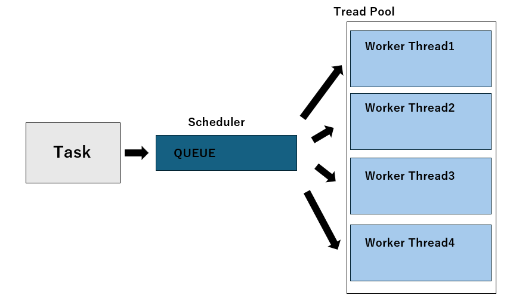

## 非同期ライブラリ
Rustのasync/awaitによる非同期プログラミングを支える代表的なランタイムであるTokioは、内部でepoll（Linux）やkqueue（macOS）などのI/O多重化の仕組みを利用しています。`epoll_executor/src/main.rs`のような自作のExecutorでも非同期I/Oは可能ですが、Tokioとの大きな違いは、あらかじめ複数のスレッドを用意し、それらでタスクを並列実行できる点にあります。Tokioのマルチスレッドランタイムはスレッドプールを持ち、生成されたタスクを空いているスレッドにスケジューリングすることで、高いスループットと効率的な並列実行を実現しています。Tokioではデフォルトでは実行環境のCPUコア数だけスレッドを起動します。  




次の2つのコードはどちらも10秒後に`"wake!"`と出力するコードです。では何が違うのでしょう。

`sleep_block/src/main.rs`
```rust
use std::{thread,time};

#[tokio::main]
async fn main(){
    tokio::join!(async move{
        let ten_secs=time::Duration::from_secs(10);
        thread::sleep(ten_secs);
        println!("wake!")
    });
}
```

`sleep_nonblocking/src/main.rs`
```rust
use std::time;

#[tokio::main]
async fn main(){
    tokio::join!(async move{
        let ten_secs=time::Duration::from_secs(10);
        tokio::time::sleep(ten_secs).await;
        println!("wake!");
    });
}
```

1つ目のコード (`sleep_blocking/src/main.rs`) では現在のスレッドを完全に停止します。そのためほかの非同期タスクも止まります。  
2つ目のコード (`sleep_nonblocking/src/main.rs`) 非同期タイマーを使い、他のタスクの邪魔をしません。sleep中のTaskはカーネルから通知が来るまでスレッドの外で待機しているのです。 