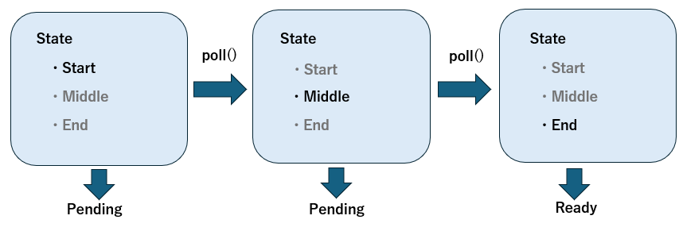
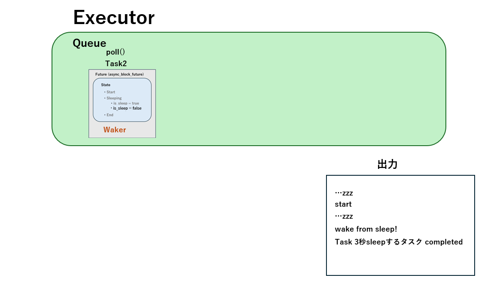

## 内部の動作

  - [Future](#Future)  
  - [aysnc/await](#aysncawait)  
  - [Task、Executor、Waker](#taskexecutorwaker)  
  - [Spawner](#spawner)  
  - [具体的な動作](#具体的な動作)  
  - [I/O多重化](#io多重化)  

### Future
Rustの非同期処理には中心的な概念があります。それが**Future**です。Futureとは簡単に言うと「いずれ値を返すかもしれない計算」を表現するオブジェクトです。
* ネットワークからデータを読む
* ディスクからファイルを読み込む
* タイマーで一定時間待つ  

といった即座には完了しない処理を、RustではFutureという型で表します。　　
Futureとは**Futureトレイト**を実装した構造体です。
```rust
pub trait Future {
    type Output;

    fn poll(
        self: Pin<&mut Self>,
        cx: &mut Context<'_>
    ) -> Poll<Self::Output>;
}
```
Futrueのコアとなるメソッドは`poll`です。このメソッドはFutureに「すすめ！」と伝えるメソッドで、`poll`を呼びだすと返り値としてenumの`Poll`を返します。  
`Pin`はアドレスを絶対に変えないことを保障します。Futureのステートマシンはコンパイラによって内部的に自己参照を生じさせる可能性があります。自己参照のような構造がある状態で、アドレスが変わることをRustのコンパイラは許しません。そのため`Pin`でアドレスを動かさないようにするのです。

```rust
enum Poll<T> {
    Ready(T),   // 計算が終わり、結果が出た
    Pending,    // まだ結果が出ていない
}
```

`poll`が`Pending`を返した場合、処理は一旦中断されます。`Ready`を返した場合、計算は終了します。


指定した時間眠るSleepFutureを実装します。ここで使われているSimpleFutureトレイトはFutureトレイトと同じです。このように`poll`が呼ばれると、`Pending`か`Ready`のどちらかの値を返します。
* 眠っている ⇒ `Pending` (待機状態)
* 起きた ⇒ `Ready` (終了状態)
<details>

```rust
impl SleepFuture{
    fn new(duration:Duration)->Self{
        let sleeper=Self{
            is_sleep: Arc::new(Mutex::new(true)),
            sleep_time: duration,
            spawned: false,
            waker: Arc::new(Mutex::new(None)),
        };
        sleeper
    }
}

impl SimpleFuture for SleepFuture{
    type Output=&'static str;
    fn poll(mut self:Pin<&mut Self>,cx:&mut Context)->Poll<Self::Output>{
        let this=self.as_mut().get_mut();
        if *this.is_sleep.lock().unwrap(){
            println!("...zzz");
            if !this.spawned{
                this.spawned=true;
                let is_sleep_clone=this.is_sleep.clone();
                let waker_clone=this.waker.clone();
                let sleep_time=this.sleep_time;

                thread::spawn(move||{
                    thread::sleep(sleep_time);
                    {
                        *is_sleep_clone.lock().unwrap()=false;
                    }
                    // スレッドがsleepを終えたタイミングにwakerがあればw.wake()が呼ばれる
                    if let Some(w)=waker_clone.lock().unwrap().take(){
                        w.wake(); //スレッドではwake()を呼ぶ
                    }
                });
            }
            *this.waker.lock().unwrap()=Some(cx.waker().clone());
            Poll::Pending
        }else{
            Poll::Ready("wake from sleep!")
        }
    }
}
```

</details>

### aysnc/await
Rustのコンパイラはasyncブロックの中身をステートマシンに変換します。すなわち、asyncで囲われた部分は、いくつかの状態に分かれるのです。この囲われた部分はまるまるFutureになります。ということは、`poll`が呼び出されると`Ready`か`Pending`を返すということです。asyncブロックで生成されたFutureはステートマシンに変換され、`poll`されるたびに状態を変換させながら`Pending`か`Ready`を返します。例えば、以下のようにasyncブロックで囲われた`printfn!()`だけのFutureはどのようなステートマシンに変換されるでしょうか。


このように1単位の処理に対して1単位の状態が割り当てられます。最初の状態は`Start`で`poll`が呼ばれたら`Pending`を返します。再度`poll`が呼ばれたら`Middle`に遷移して`Pending`を返します。また`poll`されたら`End`に遷移して`Ready`を返して、Futureを解放します。


```rust
async fn my_future(){
    println!("Start");
    println!("Middle");
    println!("End");
}
```
この僅か5行のコードは下記のコードのような動作をします。
<details>

```rust
use {
    std::{
        //ops::{Coroutine,CoroutineState},
        future::Future,
        pin::Pin,
        sync::{Arc, Mutex},
        task::{Context, Waker},
        thread::{sleep},
        time::Duration,
    },
};


trait SimpleFuture{
    type Output;
    fn poll(self:Pin<&mut Self>)->Poll<Self::Output>; //自己参照を持つ型をmoveから守る
}

#[derive(Debug)]
enum Poll<T>{
    Ready(T),
    Pending,
}

struct MyFuture{
    state: State,
}

#[derive(Debug)]
enum State{
    Start,
    Middle,
    End,
}

impl MyFuture{
    fn new()->Self{
        Self{
            state:State::Start,
        }
    }
}

impl SimpleFuture for MyFuture{
    type Output=&'static str;
    fn poll(mut self:Pin<&mut Self>)->Poll<Self::Output>{
        let this=self.as_mut().get_mut();
        match this.state{
            State::Start=>{
                println!("Start");
                println!("Yielded: Start -> Middle");
                this.state=State::Middle;
                Poll::Pending
            }
            State::Middle=>{
                println!("Middle");
                println!("Yielded: Middle -> End");
                this.state=State::End;
                Poll::Pending
            }
            State::End=>{
                println!("End");
                Poll::Ready("finished")
            }

        }
    }
}

fn main(){
    let mut my_fut=MyFuture::new();
    let mut pinned=Box::pin(my_fut);

    let mut poll_num=1;
    loop{
        println!("loop...");
        let res=pinned.as_mut().poll();
        match res{
            Poll::Ready(val)=>{
                println!("Cotroutine returned: {} poll={:?}",poll_num,res);
                break;
            }
            Poll::Pending=>{
                println!("Coroutine yielded: {} poll={:?}",poll_num,res);
            }
        }
        poll_num+=1;
        sleep(Duration::from_secs(2));
    }
}


```

</details>

先ほどのSleepFutureをaysncブロックに含めてみるとどのようなステートマシンになるでしょうか。
```rust
async fn async_block_future(){
    println!("start");
    SleepFuture::new(Duration::from_secs(10)).await;
    println!("end");
}
```

asyncブロックはFutureを生成します。ということは、Futureの中にFutureが入っているということになります。Futureは`Pending`を返すことで中断する可能性があります。SleepFutureのように中断する可能性のある部分は`.await`をつける必要があります。Futureがネストしている部分に`.await`をつける必要があるのです。上記の僅か6行のコードは下記のようなコードに書き換えることが
出来ます。

<details>

```rust
struct AsyncBlockFuture{
    state: AsyncBlockState,
    sleep_future: Option<Pin<BoxFuture>>,
}

#[derive(Debug)]
enum AsyncBlockState{
    Start,
    Sleeping,
    End,
}

impl AsyncBlockFuture{
    fn new(duration: Duration)->Self{
        Self{
            state: AsyncBlockState::Start,
            sleep_future: Some(boxed(SleepFuture::new(duration))),
        }
    }
}

impl SimpleFuture for AsyncBlockFuture{
    type Output=&'static str;
    fn poll(mut self:Pin<&mut Self>,cx:&mut Context)->Poll<Self::Output>{
        let this=self.as_mut().get_mut();
        match this.state{
            AsyncBlockState::Start=>{
                println!("start");
                this.state=AsyncBlockState::Sleeping;
                cx.waker().wake_by_ref();
                Poll::Pending
            }
            AsyncBlockState::Sleeping=>{
                let fut=this.sleep_future.as_mut().unwrap();
                match fut.as_mut().poll(cx){
                    Poll::Pending=>{
                        Poll::Pending
                    }
                    Poll::Ready(val)=>{
                        println!("{}",val);
                        this.state=AsyncBlockState::End;
                        cx.waker().wake_by_ref();
                        Poll::Pending
                    }
                }
            }
            AsyncBlockState::End=>{
                Poll::Ready("end")
            }
        }
    }
}
```

</details>


### Task、Executor、Waker
実際にはasyncブロックやawaitを書くだけでは動きません。
```rust
async fn async_block_future(){
    println!("start");
    SleepFuture::new(Duration::from_secs(10)).await;
    println!("end");
}

fn main(){
    let foo=async_block_future();
    foo.await();
}
```
これでは動かないのです。実際に動かすにはFuture以外にもオブジェクトが必要なのです。  
Rustの非同期処理の内部には主に3つのロールがあります。Task、Executor、Wakerです。レストランの厨房を想像してください。料理が注文されて、ウェイターが注文をシェフに知らせます。シェフは注文された料理のリストから一つずつ料理を作ります。料理の注文はTask、注文を知らせるウェイターはWaker、注文された料理をつくるシェフはExecutorに当たります。
#### Task
非同期処理の単位で、Futureをラップしたものです。タスクは主に以下の情報を持っています。
* Future：計算の本体
* 状態管理：Futureがどの段階まで進んでいるか
* Waker：自分をExecutorに再登録する  

`poll`が呼ばれることで、Futureの状態が遷移していきます。最終的に`Ready`を返すことで、そのTaskは解放されます。  
下記にTaskのコード例を挙げます。このコードではTaskは自分自身をExecutorに再スケジューリングするために`poll`されるたびにWakerを作ります。また、`poll`されるたびに内部のFutureの`poll`を呼びま。結果が`Pending`ならWakerを叩いてTaskを再スケジューリングし、`Ready`ならTaskを解放します。

<details>

```rust
// Task /////////////////////////////////////////////////////////////////////////////////////////

struct Task{
    name: String,
    futures: Mutex<Vec<Option<Pin<BoxFuture>>>>,
    executor: Arc<ExecutorInner>,
}

impl Task{
    //自分自身をExecutorのqueueにpushする
    fn schedule(self: &Arc<Self>){
        self.executor.queue.lock().unwrap().push_back(self.clone());
    }

    fn poll(self: Arc<Self>){
        let mut futs=self.futures.lock().unwrap();
        if !futs.is_empty(){
            let mut fut_slot=futs.remove(0);
            if let Some(mut fut)=fut_slot.take(){
                let waker=create_waker(self.clone());
                let mut ctx=Context::from_waker(&waker);

                let res=fut.as_mut().poll(&mut ctx);
                match res{
                    Poll::Ready(val)=>{
                        println!("{}",val);
                        if !futs.is_empty(){
                            self.schedule();
                        }else{
                            println!("Task {} copleted!",self.name);
                        }
                    }
                    Poll::Pending=>{
                        futs.insert(0,Some(fut));
                    }
                }
            }
        }
    }
}
```

</details>

#### Executor
Taskを管理・実行するRustの非同期の心臓部分です。Executorは実行待ちのTaskを`poll`します。逆に言えば、実行待ちのTaskがなければ、なにもしません。  
下記にExecutorのコード例を挙げます。このコードではExecutorは実行待ちのTaskを持つキューを持ちます。`run`でキューにTaskが入っていないかを逐一チェックします。このように逐一チェックする方式を**ポーリング式**と呼びます

<details>

```rust
// Executor ///////////////////////////////////////////////////////////////////////////
//ExecutorInnerは実行待ちのタスクを管理する
//複数スレッドからタスクが追加、取り出しされないようにする
struct ExecutorInner{
    queue: Mutex<VecDeque<Arc<Task>>>, //同じタスクを共有
}

//同じキューを共有
struct Executor{
    inner: Arc<ExecutorInner>,
}

impl Executor{
    fn new()->Self{
        Self {
            inner: Arc::new(ExecutorInner {
                queue: Mutex::new(VecDeque::new()),
             })
        }
    }

    fn run(&self){
        loop{
            let task_opt=self.inner.queue.lock().unwrap().pop_front();

            if let Some(task)=task_opt{
                task.poll();
            }else{
                thread::sleep(Duration::from_millis(10));
            }
        }
       
    }
}
```
</details>

#### Waker
Taskが計算可能になったことをExecutorに伝えます。具体的には、ExecutorのキューにTaskをプッシュします。  
下記にWakerのコード例を挙げます。`create_waker`によってWakerが作られます。作られたWakerはTask内のFutureの`Context`に入れられます。

<details>

```rust
// Waker ///////////////////////////////////////////////////////////////////////////////////
fn create_waker(task: Arc<Task>) -> Waker{
    // Wakerのクローンをつくる
    unsafe fn clone(data: *const ()) -> RawWaker {
        let arc = Arc::from_raw(data as *const Task); //from_rawしたarcはdropすると参照カウントが-1になる
        let arc_clone = arc.clone();
        std::mem::forget(arc); //ドロップした後に参照カウンタを-1しない
        RawWaker::new(data, &VTABLE)
    }

    // Taskを再スケジューリングしてWakerを消費する
    unsafe fn wake(data: *const()){
        let task=Arc::from_raw(data as *const Task);
        task.schedule();
    }

    // Wakerは消費されない
    unsafe fn wake_by_ref(data: *const()){
        let task=Arc::from_raw(data as *const Task);
        task.schedule();
        std::mem::forget(task);
    }

    //参照カウントを1減らす
    unsafe fn drop(data: *const()){
        //let _=Arc::from_raw(data as *const Task);
    }

    //clone,wake,wake_by_ref,dropがWakerに紐づく
    static VTABLE: RawWakerVTable=RawWakerVTable::new(clone,wake,wake_by_ref,drop);

    let ptr=Arc::into_raw(task) as *const(); //Arc<Task>を生ポインタ化
    let raw=RawWaker::new(ptr,&VTABLE); //RawWakerを作成
    unsafe {Waker::from_raw(raw)} //Waker::from_rawで安全なWakerに変換
}
```

</details>

#### Spawner
Task、Executor、Wakerが注文、シェフ、ウェイターだとするとSpawnerは料理の注文をするお客さんです。3つと比べると、メイン級の働きはしないかもしれませんが、便利になる役割を担います。SpawnerはFutureをTaskにラップして、そのTaskをExecutorにプッシュします。すなわち、Taskが  
`poll`→再スケジューリング→`poll`→再スケジューリング ・・・  
のように状態を変え続けるきっかけそのものです。

<details>

```rust
// Spawner ///////////////////////////////////////////////////////////////////////////
struct Spawner{
    inner: Arc<ExecutorInner>,
}

impl Spawner{
    fn new(executor: &Executor)->Self{
        Self{
            inner: executor.inner.clone(),
        }
    }
    fn spawn(&self,name:&str, futures:Vec<Option<Pin<BoxFuture>>>){
        let task=Arc::new(Task{
            name: name.to_string(),
            futures: Mutex::new(futures),
            executor: self.inner.clone(),
        });

        self.inner.queue.lock().unwrap().push_back(task);
    }
}
```

</details>

### 具体的な動作
この例ではTaskを2つ作ります。  
1つは`sleep_future_3secs`というFutureを内包するTaskです。このFutureは最初に`...zzz`と出力した後、別スレッドを起動して3秒間スリープします。3秒間スリープしたら`wake_from`と出力し、Wakerによって再度Executorにプッシュます。
* `is_sleep=true`
* `is_sleep=false`

の2つの状態を持ち、3秒間のスリープが完了したら`is_sleep=false`へ状態遷移します。そして、再度`poll`されると`Ready`を返して終了します。  

もう1つは`async_block_future`というFutureを内包するTaskです。このFutureは
* Start
* Sleeping
    - `is_sleep=true`
    - `is_sleep=false`
* End  

の状態を持ちます。Startで`start`と出力してSleeping状態に遷移します。Sleepingは1つ目のTaskと同じ動作をします。`is_sleeping=false`の状態になり、再度`poll`されたらEndに遷移します。再スケジューリングされ、また`poll`されます。End状態なので`Ready`を返し終了します。
<details>

`original_executor/src/main.rs`

```rust
use {
    std::{
        thread,
        pin::Pin,
        sync::{Arc, Mutex},
        thread::{sleep},
        time::Duration,
        collections::{VecDeque},
        task::{RawWaker,RawWakerVTable,Waker,Context},
    },
};


// Pin: 自己参照を持つ型をmoveから守る
// Context: Wakerを渡すためのラッパー
trait SimpleFuture{
    type Output;
    fn poll(self:Pin<&mut Self>,cx: &mut Context)->Poll<Self::Output>; 
}

#[derive(Debug)]
enum Poll<T>{
    Ready(T),
    Pending,
}


type BoxFuture = Box<dyn SimpleFuture<Output = &'static str> + Send>;
fn boxed<F>(fut: F) -> Pin<Box<dyn SimpleFuture<Output = &'static str> + Send>>
where
    F: SimpleFuture<Output = &'static str> + Send + 'static,
{
    Pin::from(Box::new(fut) as Box<dyn SimpleFuture<Output = &'static str> + Send>)
}
// Task /////////////////////////////////////////////////////////////////////////////////////////
struct Task{
    name: String,
    futures: Mutex<Vec<Option<Pin<BoxFuture>>>>,
    executor: Arc<ExecutorInner>,
}

impl Task{
    //自分自身をExecutorのqueueにpushする
    fn schedule(self: &Arc<Self>){
        self.executor.queue.lock().unwrap().push_back(self.clone());
    }

    fn poll(self: Arc<Self>){
        let mut futs=self.futures.lock().unwrap();
        if !futs.is_empty(){
            let mut fut_slot=futs.remove(0);
            if let Some(mut fut)=fut_slot.take(){
                let waker=create_waker(self.clone());
                let mut ctx=Context::from_waker(&waker);

                let res=fut.as_mut().poll(&mut ctx);
                match res{
                    Poll::Ready(val)=>{
                        println!("{}",val);
                        if !futs.is_empty(){
                            self.schedule();
                        }else{
                            println!("Task {} copleted!",self.name);
                        }
                    }
                    Poll::Pending=>{
                        futs.insert(0,Some(fut));
                    }
                }
            }
        }
    }
}

// Spawner ///////////////////////////////////////////////////////////////////////////
struct Spawner{
    inner: Arc<ExecutorInner>,
}

impl Spawner{
    fn new(executor: &Executor)->Self{
        Self{
            inner: executor.inner.clone(),
        }
    }
    fn spawn(&self,name:&str, futures:Vec<Option<Pin<BoxFuture>>>){
        let task=Arc::new(Task{
            name: name.to_string(),
            futures: Mutex::new(futures),
            executor: self.inner.clone(),
        });

        self.inner.queue.lock().unwrap().push_back(task);
    }
}

// Executor ///////////////////////////////////////////////////////////////////////////
//ExecutorInnerは実行待ちのタスクを管理する
//複数スレッドからタスクが追加、取り出しされないようにする
struct ExecutorInner{
    queue: Mutex<VecDeque<Arc<Task>>>, //同じタスクを共有
}

//同じキューを共有
struct Executor{
    inner: Arc<ExecutorInner>,
}

impl Executor{
    fn new()->Self{
        Self {
            inner: Arc::new(ExecutorInner {
                queue: Mutex::new(VecDeque::new()),
             })
        }
    }

    fn run(&self){
        loop{
            let task_opt=self.inner.queue.lock().unwrap().pop_front();

            if let Some(task)=task_opt{
                task.poll();
            }else{
                thread::sleep(Duration::from_millis(10));
            }
        }
       
    }
}

// Waker ///////////////////////////////////////////////////////////////////////////////////
fn create_waker(task: Arc<Task>) -> Waker{
    // Wakerのクローンをつくる
    unsafe fn clone(data: *const ()) -> RawWaker {
        let arc = Arc::from_raw(data as *const Task); //from_rawしたarcはdropすると参照カウントが-1になる
        let arc_clone = arc.clone();
        std::mem::forget(arc); //ドロップした後に参照カウンタを-1しない
        RawWaker::new(data, &VTABLE)
    }

    // Taskを再スケジューリングしてWakerを消費する
    unsafe fn wake(data: *const()){
        let task=Arc::from_raw(data as *const Task);
        task.schedule();
    }

    // Wakerは消費されない
    unsafe fn wake_by_ref(data: *const()){
        let task=Arc::from_raw(data as *const Task);
        task.schedule();
        std::mem::forget(task);
    }

    //参照カウントを1減らす
    unsafe fn drop(data: *const()){
        //let _=Arc::from_raw(data as *const Task);
    }

    //clone,wake,wake_by_ref,dropがWakerに紐づく
    static VTABLE: RawWakerVTable=RawWakerVTable::new(clone,wake,wake_by_ref,drop);

    let ptr=Arc::into_raw(task) as *const(); //Arc<Task>を生ポインタ化
    let raw=RawWaker::new(ptr,&VTABLE); //RawWakerを作成
    unsafe {Waker::from_raw(raw)} //Waker::from_rawで安全なWakerに変換
}


// Future ////////////////////////////////////////////////////////////////////////////////
struct MyFuture{
    state: MyState,
}


#[derive(Debug)]
enum MyState{
    Start,
    Middle,
    End,
}

impl MyFuture{
    fn new()->Self{
        Self{
            state:MyState::Start,
        }
    }
}

impl SimpleFuture for MyFuture{
    type Output=&'static str;
    fn poll(mut self:Pin<&mut Self>,cx:&mut Context)->Poll<Self::Output>{
        let this=self.as_mut().get_mut();
        match this.state{
            MyState::Start=>{
                println!("Start");
                println!("Yielded: Start -> Middle");
                this.state=MyState::Middle;
                cx.waker().wake_by_ref(); //自分自身をqueueにpushする
                Poll::Pending
            }
            MyState::Middle=>{
                println!("Middle");
                println!("Yielded: Middle -> End");
                this.state=MyState::End;
                cx.waker().wake_by_ref(); // dorpしない
                Poll::Pending
            }
            MyState::End=>{
                println!("End");
                Poll::Ready("finished")
            }

        }
    }
}

struct SleepFuture{
    is_sleep: Arc<Mutex<bool>>,
    sleep_time: Duration,
    spawned: bool,
    waker: Arc<Mutex<Option<Waker>>>,
}

impl SleepFuture{
    fn new(duration:Duration)->Self{
        let sleeper=Self{
            is_sleep: Arc::new(Mutex::new(true)),
            sleep_time: duration,
            spawned: false,
            waker: Arc::new(Mutex::new(None)),
        };
        sleeper
    }
}

impl SimpleFuture for SleepFuture{
    type Output=&'static str;
    fn poll(mut self:Pin<&mut Self>,cx:&mut Context)->Poll<Self::Output>{
        let this=self.as_mut().get_mut();
        if *this.is_sleep.lock().unwrap(){
            println!("...zzz");
            if !this.spawned{
                this.spawned=true;
                let is_sleep_clone=this.is_sleep.clone();
                let waker_clone=this.waker.clone();
                let sleep_time=this.sleep_time;

                thread::spawn(move||{
                    thread::sleep(sleep_time);
                    {
                        *is_sleep_clone.lock().unwrap()=false;
                    }
                    // スレッドがsleepを終えたタイミングにwakerがあればw.wake()が呼ばれる
                    if let Some(w)=waker_clone.lock().unwrap().take(){
                        w.wake(); //スレッドではwake()を呼ぶ
                    }
                });
            }
            *this.waker.lock().unwrap()=Some(cx.waker().clone());
            Poll::Pending
        }else{
            Poll::Ready("wake from sleep!")
        }
    }
}


struct AsyncBlockFuture{
    state: AsyncBlockState,
    sleep_future: Option<Pin<BoxFuture>>,
}

#[derive(Debug)]
enum AsyncBlockState{
    Start,
    Sleeping,
    End,
}

impl AsyncBlockFuture{
    fn new(duration: Duration)->Self{
        Self{
            state: AsyncBlockState::Start,
            sleep_future: Some(boxed(SleepFuture::new(duration))),
        }
    }
}

impl SimpleFuture for AsyncBlockFuture{
    type Output=&'static str;
    fn poll(mut self:Pin<&mut Self>,cx:&mut Context)->Poll<Self::Output>{
        let this=self.as_mut().get_mut();
        match this.state{
            AsyncBlockState::Start=>{
                println!("start");
                this.state=AsyncBlockState::Sleeping;
                cx.waker().wake_by_ref();
                Poll::Pending
            }
            AsyncBlockState::Sleeping=>{
                let fut=this.sleep_future.as_mut().unwrap();
                match fut.as_mut().poll(cx){
                    Poll::Pending=>{
                        Poll::Pending
                    }
                    Poll::Ready(val)=>{
                        println!("{}",val);
                        this.state=AsyncBlockState::End;
                        cx.waker().wake_by_ref();
                        Poll::Pending
                    }
                }
            }
            AsyncBlockState::End=>{
                Poll::Ready("end")
            }
        }
    }
}

// main ///////////////////////////////////////////////////////////////////////////////////////////////////
fn main(){
    let executor=Executor::new();
    let spawner=Spawner::new(&executor);
    let my_future=MyFuture::new();


    let sleep_future_3secs=SleepFuture::new(Duration::from_secs(3));
    let async_block_future=AsyncBlockFuture::new(Duration::from_secs(6));

    let sleep_future_3secs=Some(boxed(sleep_future_3secs));
    let async_block_future=Some(boxed(async_block_future));

    spawner.spawn("3秒sleepするタスク",vec![sleep_future_3secs]);
    spawner.spawn("Start、Sleep、Endの状態を持つタスク",vec![async_block_future]);

    executor.run();
}
```

出力
```
...zzz
start
...zzz
wake from sleep!
Task 3秒sleepするタスク copleted!
wake from sleep!
end
Task Start、Sleep、Endの状態を持つタスク copleted!
```

</details>

まずExecutorを作ります。そして、Spawnerによって`sleep_future_3secs`というFutureをもつTask1と、`async_block_future`というFutureをもつTask2を生成します。2つのTaskは生成された後、Executorのキューにプッシュされます。

Executorはキューに入っているTaskを順番に`poll`します。最初はTask1が`poll`されます。

`poll`されたTask1は別スレッドを立てて、スリープします。そして、まだTaskの処理が完了していないため`Pending`を返し、`"...zzz"`と出力します。Task1は中断されたのです。

次にTask2がExecutorによって`poll`されます。Task2は自分自身と紐づくWakerを生成して、そのWakerを発火させます。

するとTask2は`Pending`を返して、状態を`Start`から`Sleeping (is_sleep=true)`に変更してExecutorに再プッシュされます。そして`"start"`と出力します。その際、Task1は眠ったままです。

Task2は2度目の`poll`されます。

Task2はTask1同様、スレッドを立てて、スリープします。まだ、処理が完了していないため`Pending`を返し`"...zzz"`を出力して、処理を中断します。

Task1が眠り始めてから3秒がたったら、Task1は自分自身と結びつくWakerを発火させ、Executorにpushします。そしてTask1は状態を`is_sleep=true`から`is_sleep=false`に遷移させます。

Task1が2度目の`poll`をされます。

Task1は`is_sleep=true`の状態で`poll`されたため、`"wake from sleep!"`と出力し、`Ready`を返します。Task1が完了したのです！Task1が完了したしるしとして`"Task 3秒sleepするタスク completed"`と出力します。

さて、Task2のみとなりました。このタスクはいまだに眠っています。

Task2が眠り始めてから6秒がたちました。Task2はWakerを発火させ、状態を`Sleeping (is_sleep=false)`に遷移させます。

Task2がExecutorによって3度目の`poll`をされます。Wakerを発火させます。

Task2はまだ完了していないので`Pending`を返して、状態を`Sleeping`から`End`に遷移させます。そして`wake from sleep!`と出力して、Executorに入ります。

Task2が4度目の`poll`されます。

`End`状態で`poll`されたTask2は、すべて処理が完了したことを表す`Ready`を返します。そして`"end"`、Task2が完了したことを表すように`"Task Start、Sleep、Endの状態を持つタスクcompleted!"`と出力します。

Task1、2はどちらも完了しました。


もし非同期処理でなければ、Task1が眠っている間、Task2が動くことはなく、Task1が起きるまで待機しています。  


### I/O多重化
ただ、上記のコード (`original_executor/src/main.rs`) は実際に使われている非同期処理の動作とは2つの点で少し異なります。  
1つはExecutorのイベントを検出する方法です。上記のコードではExecutorはTaskが入っているか10msに1回チェックします。このようにスケジューラがイベントがあるかを逐一チェックする方式を**ポーリング式**と呼びます。ポーリング式では、ExecutorがイベントをチェックするたびにCPUを使うため、効率が悪いです。それに対して、**イベント駆動式**ではイベントが来たかをカーネルを通してExeutorに通知します。そのため、Executorはイベント (Task) が来るまでなにもしません。

| 項目    | ポーリング式            | イベント駆動式              |
| ----- | ----------------- | -------------------- |
| 方法    | 定期的に自分で確認する       | カーネルに待たせ、通知を受ける      |
| CPU効率 | 悪い（無駄に動く）         | 良い（寝て待つ）             |
| 例     | select の 0秒タイムアウト | select の NULL タイムアウト |

2つ目は非同期I/Oの方法です。上記のコードではsleepするたびにTaskがスレッドを立て、タイマーを起動させていました。指定の時間たったらWakerを発火させてTaskをExecutorにプッシュしていました。ただ、もしTaskが1,000個や10,000個存在したら、スレッドがTaskの数だけ立てられます。その結果、メモリを多く消費したり、コンテキストスイッチのコストが大きくなったりして、CPU効率が悪くなります。この解決方法は、非同期I/O を別スレッドで一括管理することです。具体的には
* epollを使って非同期I/Oを監視するスレッドを立てる
* epollがデータの到着の通知をカーネルから受け取る
* epollがデータが到着したという通知を受け取ったら、Taskと結びついたWakerを発火させる


epollがデータの到着の通知を待っている間、CPUはもちろん消費しません。  

次のコードは標準入力を受け取り、それに対して非同期で`10`を加算した結果を出力するような実装の例です。
* Executor、Spawner、Epollを構築
* `StdinFuture`を`spawn`してタスクとして登録
* `epoll`専用スレッドを立て、標準入力 (fd=0) を監視
* 入力が来ると`epoll_wait`が通知され、`set_ready()`が呼ばれる
* `set_ready`によりWakerが呼ばれて、タスクが再スケジューリングされる
* Executorは`event_fd`による通知を検知し、`poll()`を呼んでFutureの状態を進める
* 入力を読み、加算結果を表示し、タスクを終了する

<details>

`epoll_executor/src/main.rs`
```rust
use {
    std::{
        collections::{HashMap,VecDeque},
        os::unix::io::RawFd,
        pin::Pin,
        sync::{
            atomic::{AtomicBool, Ordering},
            Arc, Mutex,
        },
        task::{Context, RawWaker, RawWakerVTable, Waker},
        thread,
    },
    nix::{
        sys::{
            epoll::{epoll_create1, epoll_ctl, epoll_wait, EpollCreateFlags, EpollEvent, EpollFlags, EpollOp},
            eventfd::{eventfd, EfdFlags},
        },
        unistd::{read, write},
    },
};


// Pin: 自己参照を持つ型をmoveから守る
// Context: Wakerを渡すためのラッパー
trait SimpleFuture{
    type Output;
    fn poll(self:Pin<&mut Self>,cx: &mut Context)->Poll<Self::Output>; 
}

#[derive(Debug)]
enum Poll<T>{
    Ready(T),
    Pending,
}


type BoxFuture = Box<dyn SimpleFuture<Output = &'static str> + Send>;
fn boxed<F>(fut: F) -> Pin<Box<dyn SimpleFuture<Output = &'static str> + Send>>
where
    F: SimpleFuture<Output = &'static str> + Send + 'static,
{
    Pin::from(Box::new(fut) as Box<dyn SimpleFuture<Output = &'static str> + Send>)
}
// Task /////////////////////////////////////////////////////////////////////////////////////////
struct Task{
    name: String,
    futures: Mutex<Vec<Option<Pin<BoxFuture>>>>,
    executor: Arc<ExecutorInner>,
}

impl Task{
    //自分自身をExecutorのqueueにpushする
    fn schedule(self: &Arc<Self>){
        self.executor.queue.lock().unwrap().push_back(self.clone());

        // eventfdに書いてExecutorを起こす
        let data=1u64.to_ne_bytes();
        write(self.executor.eventfd_fd,&data).unwrap();
    }

    fn poll(self: Arc<Self>){
        let mut futs=self.futures.lock().unwrap();
        if !futs.is_empty(){
            let mut fut_slot=futs.remove(0);
            if let Some(mut fut)=fut_slot.take(){
                let waker=create_waker(self.clone());
                let mut ctx=Context::from_waker(&waker);

                let res=fut.as_mut().poll(&mut ctx);
                match res{
                    Poll::Ready(val)=>{
                        println!("{}",val);
                        if !futs.is_empty(){
                            self.schedule();
                        }else{
                            println!("Task {} completed!",self.name);
                        }
                    }
                    Poll::Pending=>{
                        futs.insert(0,Some(fut));
                    }
                }
            }
        }
    }
}

// Spawner ///////////////////////////////////////////////////////////////////////////
struct Spawner{
    inner: Arc<ExecutorInner>,
}

impl Spawner{
    fn new(executor: &Executor)->Self{
        Self{
            inner: executor.inner.clone(),
        }
    }
    fn spawn(&self,name:&str, futures:Vec<Option<Pin<BoxFuture>>>){
        let task=Arc::new(Task{
            name: name.to_string(),
            futures: Mutex::new(futures),
            executor: self.inner.clone(),
        });

        self.inner.queue.lock().unwrap().push_back(task);

        // Executorに通知
        let data=1u64.to_ne_bytes();
        write(self.inner.eventfd_fd,&data).unwrap();
    }

}

// Executor ///////////////////////////////////////////////////////////////////////////
//ExecutorInnerは実行待ちのタスクを管理する
//複数スレッドからタスクが追加、取り出しされないようにする
struct ExecutorInner{
    queue: Mutex<VecDeque<Arc<Task>>>, //同じタスクを共有
    eventfd_fd: RawFd,
}

//同じキューを共有
struct Executor{
    inner: Arc<ExecutorInner>,
}

impl Executor{
    fn new()->Self{
        let eventfd_fd=eventfd(0,EfdFlags::empty()).unwrap();
        Self {
            inner: Arc::new(ExecutorInner {
                queue: Mutex::new(VecDeque::new()),
                eventfd_fd,
             })
        }
    }

    fn run(&self) {
        loop {
            let mut buf = [0u8; 8];
            read(self.inner.eventfd_fd, &mut buf).unwrap();
        
            while let Some(task) = self.inner.queue.lock().unwrap().pop_front() {
                task.poll();
            }
        }
    }

}

// Waker ///////////////////////////////////////////////////////////////////////////////////
fn create_waker(task: Arc<Task>) -> Waker{
    // Wakerのクローンをつくる
    unsafe fn clone(data: *const ()) -> RawWaker {
        let arc = Arc::from_raw(data as *const Task); //from_rawしたarcはdropすると参照カウントが-1になる
        let arc_clone = arc.clone();
        std::mem::forget(arc); //ドロップした後に参照カウンタを-1しない
        RawWaker::new(data, &VTABLE)
    }

    // Taskを再スケジューリングしてWakerを消費する
    unsafe fn wake(data: *const()){
        let task=Arc::from_raw(data as *const Task);
        task.schedule();
    }

    // Wakerは消費されない
    unsafe fn wake_by_ref(data: *const()){
        let task=Arc::from_raw(data as *const Task);
        task.schedule();
        std::mem::forget(task);
    }

    //参照カウントを1減らす
    unsafe fn drop(data: *const()){
        //let _=Arc::from_raw(data as *const Task);
    }

    //clone,wake,wake_by_ref,dropがWakerに紐づく
    static VTABLE: RawWakerVTable=RawWakerVTable::new(clone,wake,wake_by_ref,drop);

    let ptr=Arc::into_raw(task) as *const(); //Arc<Task>を生ポインタ化
    let raw=RawWaker::new(ptr,&VTABLE); //RawWakerを作成
    unsafe {Waker::from_raw(raw)} //Waker::from_rawで安全なWakerに変換
}

// epoll //////////////////////////////////////////////////////////////////////////////
struct Epoll{
    epoll_fd:RawFd,
    callbacks: Arc<Mutex<HashMap<u64,Box<dyn Fn()+Send>>>>, //key=tolen(u64) value=callback関数
}

impl Epoll{
    fn new()->Epoll{
        let epoll_fd=epoll_create1(EpollCreateFlags::empty()).unwrap();
        Epoll{
            epoll_fd,
            callbacks: Arc::new(Mutex::new(HashMap::new())),
        }
    }

    fn add_fd<F>(&self,fd:RawFd,token:u64,callback:F)
    where F:Fn()+Send+'static,
    {
        let mut ev=EpollEvent::new(EpollFlags::EPOLLIN,token);
        epoll_ctl(self.epoll_fd,EpollOp::EpollCtlAdd,fd,&mut ev).unwrap();

        self.callbacks.lock().unwrap().insert(token,Box::new(callback));
    }

    fn start_loop(&self){
        let epoll_fd=self.epoll_fd;
        let callbacks=self.callbacks.clone();

        thread::spawn(move||{
            let mut events=vec![EpollEvent::empty();10];
            loop{
                let n=epoll_wait(epoll_fd,&mut events,-1).unwrap();
                for ev in &events[..n]{
                    let token=ev.data();
                    if let Some(cb)=callbacks.lock().unwrap().get(&token){
                        cb();
                    }
                }
            }
        });
    }
}


// Future ////////////////////////////////////////////////////////////////////////////////
#[derive(Clone)]
struct StdinFuture{
    is_ready: Arc<AtomicBool>,
    waker: Arc<Mutex<Option<Waker>>>,
}

impl StdinFuture{
    fn new()->Self{
        Self{
            is_ready:Arc::new(AtomicBool::new(false)),
            waker:Arc::new(Mutex::new(None)),
        }
    }

    fn set_ready(&self){
        self.is_ready.store(true,Ordering::SeqCst);
        if let Some(w)=self.waker.lock().unwrap().take(){
            w.wake();
        }
    }
}

impl SimpleFuture for StdinFuture{
    type Output=&'static str;

    fn poll(mut self:Pin<&mut Self>,cx: &mut Context)->Poll<Self::Output>{
        if self.is_ready.load(Ordering::SeqCst){ //もしis_readyがtrueならReadyを返す
            let mut buf=String::new();
            std::io::stdin().read_line(&mut buf).unwrap();
            let n:i32=buf.trim().parse().unwrap_or(0);
            println!("stdin future result: {}",n+10);
            Poll::Ready("stdin future done")
        }else{
            *self.waker.lock().unwrap()=Some(cx.waker().clone());
            Poll::Pending
        }
    }
}

// main ///////////////////////////////////////////////////////////////////////////////////////////////////
fn main(){
    let executor=Executor::new();
    let spawner=Spawner::new(&executor);

    let stdin_future=Arc::new(StdinFuture::new());
    let stdin_future_clone=stdin_future.clone();

    let epoll=Epoll::new();

    epoll.add_fd(0,0,move||{ //epollが検知したらset_readyを呼び出す
        stdin_future_clone.set_ready();
    });

    let evfd=executor.inner.eventfd_fd;
    epoll.add_fd(evfd,evfd as u64,||{

    });

    epoll.start_loop();

    let stdin_future_boxed 
    = Some(boxed((*stdin_future).clone()));
    spawner.spawn("stdin task", vec![stdin_future_boxed]);

    executor.run();
}
```

入出力例
```
39
stdin future result: 49
stdin future done
Task stdin task completed!
``` 

</details>